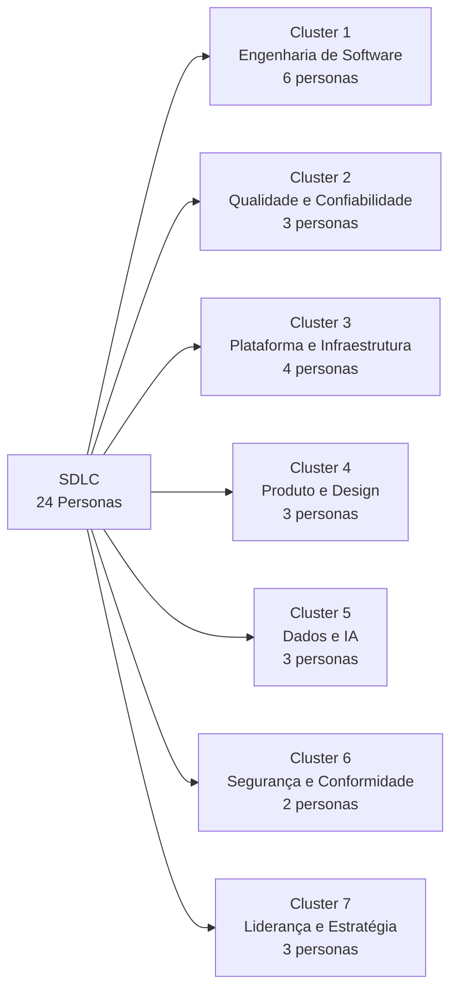
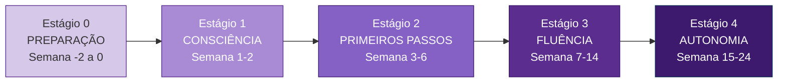
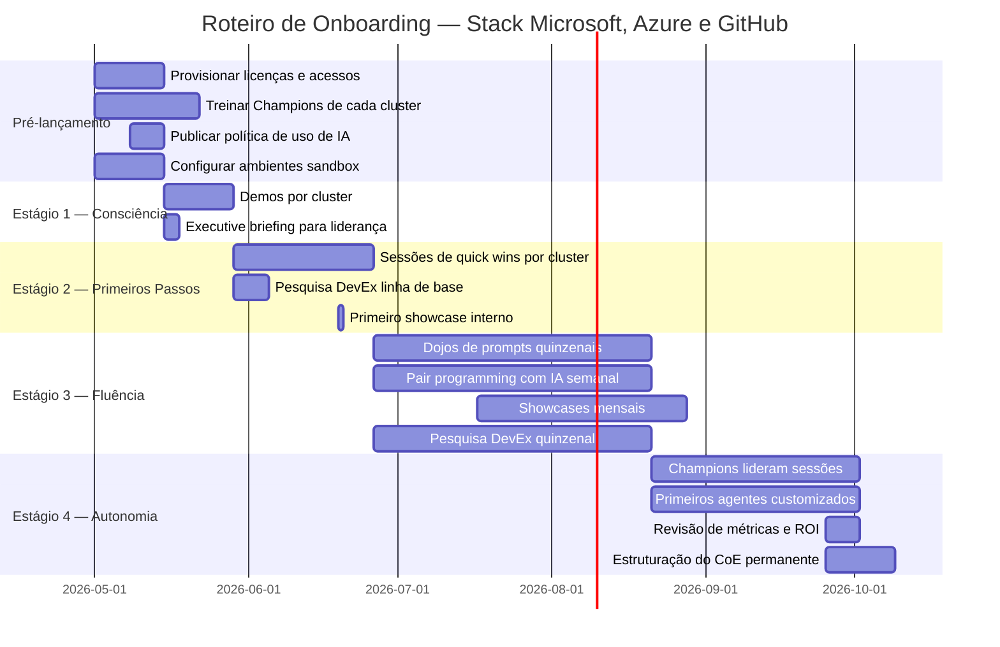

# Onboarding e Letramento em Agentes de IA: Guia de Adoção para as 24 Personas do SDLC

> Guia completo para conduzir equipes multidisciplinares, das mais técnicas às mais estratégicas, a adotar agentes de IA e automação com sucesso na stack Microsoft, Azure e GitHub, com base em evidências de pesquisa e melhores práticas de mercado.

## Histórico de Alterações

| Versão | Data       | Autor       | Alterações        |
|--------|------------|-------------|-------------------|
| 1.0.0  | 2026-04-16 | Paula Silva | Versão inicial    |
| 1.1.0  | 2026-04-16 | Paula Silva | Adicionadas seções 10, 11 e 12 |

## Índice

- [1. Por que Este Guia Existe](#1-por-que-este-guia-existe)
  - [1.1 O Problema do Letramento Desigual](#11-o-problema-do-letramento-desigual)
  - [1.2 O que a Pesquisa Diz sobre Adoção de IA](#12-o-que-a-pesquisa-diz-sobre-adoção-de-ia)
  - [1.3 Princípios Fundamentais deste Guia](#13-princípios-fundamentais-deste-guia)
- [2. Tendências e Evidências de Mercado](#2-tendências-e-evidências-de-mercado)
  - [2.1 O Estado da Adoção de IA no SDLC em 2026](#21-o-estado-da-adoção-de-ia-no-sdlc-em-2026)
  - [2.2 Por que Onboarding Estruturado é o Diferenciador](#22-por-que-onboarding-estruturado-é-o-diferenciador)
  - [2.3 Erros Mais Comuns nas Jornadas de Adoção](#23-erros-mais-comuns-nas-jornadas-de-adoção)
- [3. As 24 Personas do SDLC](#3-as-24-personas-do-sdlc)
  - [3.1 Mapeamento das Personas por Cluster](#31-mapeamento-das-personas-por-cluster)
  - [3.2 Perfil Detalhado de Cada Persona](#32-perfil-detalhado-de-cada-persona)
  - [3.3 Matriz de Ferramentas por Persona](#33-matriz-de-ferramentas-por-persona)
- [4. Framework de Onboarding em 5 Estágios](#4-framework-de-onboarding-em-5-estágios)
  - [4.1 Estágio 0: Preparação e Pré-requisitos](#41-estágio-0-preparação-e-pré-requisitos)
  - [4.2 Estágio 1: Consciência e Motivação](#42-estágio-1-consciência-e-motivação)
  - [4.3 Estágio 2: Primeiros Passos (Quick Wins)](#43-estágio-2-primeiros-passos-quick-wins)
  - [4.4 Estágio 3: Fluência Operacional](#44-estágio-3-fluência-operacional)
  - [4.5 Estágio 4: Autonomia e Contribuição](#45-estágio-4-autonomia-e-contribuição)
- [5. Letramento por Cluster de Persona](#5-letramento-por-cluster-de-persona)
  - [5.1 Cluster Engenharia de Software](#51-cluster-engenharia-de-software)
  - [5.2 Cluster Qualidade e Confiabilidade](#52-cluster-qualidade-e-confiabilidade)
  - [5.3 Cluster Plataforma e Infraestrutura](#53-cluster-plataforma-e-infraestrutura)
  - [5.4 Cluster Produto e Design](#54-cluster-produto-e-design)
  - [5.5 Cluster Dados e IA](#55-cluster-dados-e-ia)
  - [5.6 Cluster Segurança e Conformidade](#56-cluster-segurança-e-conformidade)
  - [5.7 Cluster Liderança e Estratégia](#57-cluster-liderança-e-estratégia)
- [6. Trilhas de Aprendizado por Ferramenta Microsoft](#6-trilhas-de-aprendizado-por-ferramenta-microsoft)
  - [6.1 GitHub Copilot e Agent Mode](#61-github-copilot-e-agent-mode)
  - [6.2 Azure AI Foundry](#62-azure-ai-foundry)
  - [6.3 Microsoft Copilot Studio](#63-microsoft-copilot-studio)
  - [6.4 GitHub Actions e CI/CD Inteligente](#64-github-actions-e-cicd-inteligente)
  - [6.5 Microsoft Fabric e Dados](#65-microsoft-fabric-e-dados)
- [7. Métricas de Sucesso do Onboarding](#7-métricas-de-sucesso-do-onboarding)
  - [7.1 KPIs por Estágio](#71-kpis-por-estágio)
  - [7.2 Developer Experience Score (DevEx)](#72-developer-experience-score-devex)
  - [7.3 Sinais de Risco e Intervenção](#73-sinais-de-risco-e-intervenção)
- [8. Centro de Excelência de Agentes (CoE)](#8-centro-de-excelência-de-agentes-coe)
  - [8.1 Estrutura e Papéis do CoE](#81-estrutura-e-papéis-do-coe)
  - [8.2 Comunidade de Prática Interna](#82-comunidade-de-prática-interna)
  - [8.3 Governança do Conhecimento](#83-governança-do-conhecimento)
- [9. Roteiro de Implementação em 6 Meses](#9-roteiro-de-implementação-em-6-meses)
- [10. Templates e Recursos Prontos para Uso](#10-templates-e-recursos-prontos-para-uso)
  - [10.1 Checklist de Onboarding por Persona](#101-checklist-de-onboarding-por-persona)
  - [10.2 Plano Individual 30/60/90 Dias](#102-plano-individual-306090-dias)
  - [10.3 Template de Pesquisa DevEx](#103-template-de-pesquisa-devex)
  - [10.4 Agenda-tipo do Showcase Mensal](#104-agenda-tipo-do-showcase-mensal)
  - [10.5 Template de Política de Uso de IA](#105-template-de-política-de-uso-de-ia)
- [11. Gestão de Resistência e Mudança Cultural](#11-gestão-de-resistência-e-mudança-cultural)
  - [11.1 Mapa de Resistência por Persona](#111-mapa-de-resistência-por-persona)
  - [11.2 Estratégias de Conversão por Perfil](#112-estratégias-de-conversão-por-perfil)
  - [11.3 Modelo Kotter Aplicado à Adoção de IA](#113-modelo-kotter-aplicado-à-adoção-de-ia)
- [12. Quick Wins Concretos: Um por Persona](#12-quick-wins-concretos-um-por-persona)
  - [12.1 Cluster Engenharia de Software](#121-cluster-engenharia-de-software)
  - [12.2 Cluster Qualidade e Confiabilidade](#122-cluster-qualidade-e-confiabilidade)
  - [12.3 Cluster Plataforma e Infraestrutura](#123-cluster-plataforma-e-infraestrutura)
  - [12.4 Cluster Produto e Design](#124-cluster-produto-e-design)
  - [12.5 Cluster Dados e IA](#125-cluster-dados-e-ia)
  - [12.6 Cluster Segurança e Conformidade](#126-cluster-segurança-e-conformidade)
  - [12.7 Cluster Liderança e Estratégia](#127-cluster-liderança-e-estratégia)
- [Referências](#referências)

---

## 1. Por que Este Guia Existe

### 1.1 O Problema do Letramento Desigual

A adoção de agentes de IA e automação em organizações de tecnologia falha com mais frequência por razões humanas do que por razões técnicas. A ferramenta está disponível, a licença foi comprada, a infraestrutura está provisionada, mas o time não adota. Ou adota de forma fragmentada: um grupo de desenvolvedores sênior usa o GitHub Copilot intensamente, enquanto o time de QA nunca abriu a ferramenta, o gerente de produto não sabe como ela se conecta ao seu trabalho e o CISO tem dúvidas não respondidas sobre segurança e privacidade.

Este fenômeno é chamado de **letramento desigual**, e ele é o principal sabotador de ROI em iniciativas de IA generativa. O [Microsoft Work Trend Index 2025](https://www.microsoft.com/en-us/worklab/work-trend-index) identificou que organizações com programas estruturados de letramento obtêm até 3,7 vezes mais ganhos de produtividade do que aquelas que simplesmente disponibilizam as ferramentas sem orientação.

O desafio é que o SDLC moderno envolve muito mais do que desenvolvedores. Um ciclo completo de entrega de software passa por estrategistas de produto, designers de experiência, engenheiros de dados, especialistas em segurança, analistas de negócio, gerentes de programa e dezenas de outras personas, cada uma com contexto, vocabulário e necessidades distintas.

### 1.2 O que a Pesquisa Diz sobre Adoção de IA

O [relatório SPACE Framework](https://dl.acm.org/doi/10.1145/3454122.3454124) (Forsgren et al., ACM Queue, 2021), que define as cinco dimensões de produtividade de desenvolvedores (Satisfação, Desempenho, Atividade, Comunicação, Eficiência), demonstrou que ferramentas de IA só impactam positivamente todas as cinco dimensões quando acompanhadas de mudança cultural e educação deliberada.

Pesquisa do [MIT Sloan Management Review e Boston Consulting Group (2024)](https://sloanreview.mit.edu/projects/ai-in-the-workplace/) analisou 1.700 organizações e identificou três padrões distintos de adoção: pioneiros (18%), seguidores estratégicos (54%) e atrasados (28%). O diferenciador principal entre pioneiros e seguidores não foi o orçamento de tecnologia, mas a qualidade do programa de capacitação: pioneiros investem em média 2,4 vezes mais em treinamento por colaborador do que os demais grupos.

O [GitHub Octoverse 2025](https://octoverse.github.com/) reportou que equipes com onboarding estruturado para GitHub Copilot atingem 80% de adoção ativa em 90 dias, contra apenas 23% em equipes sem programa formal. Adoção ativa é definida como uso do Copilot em pelo menos 5 dias da semana de trabalho.

O [Forrester Total Economic Impact Study: GitHub Copilot 2025](https://resources.github.com/forrester-tei-github-copilot-enterprise/) quantificou que cada dólar investido em treinamento estruturado de GitHub Copilot retorna USD 4,20 em produtividade, contra USD 1,80 quando o treinamento é autodidático.

### 1.3 Princípios Fundamentais deste Guia

Este guia é construído sobre seis princípios que a pesquisa valida como determinantes de sucesso:

**Princípio 1: Persona-first.** Cada perfil de colaborador tem motivações, medos, vocabulário e contexto de trabalho distintos. Um guia genérico de "como usar o GitHub Copilot" não funciona para um gerente de produto. O letramento precisa falar a língua de cada persona.

**Princípio 2: Quick wins primeiro.** O cérebro humano precisa de reforço positivo para mudar hábitos. O onboarding deve estruturar vitórias rápidas e visíveis nas primeiras duas semanas, antes de introduzir conceitos avançados.

**Princípio 3: Aprendizado social.** Segundo o [modelo de adoção de tecnologia de Rogers (Diffusion of Innovations, 5ª ed.)](https://www.simonandschuster.com/books/Diffusion-of-Innovations-5th-Edition/Everett-M-Rogers/9780743222099), a adoção se acelera quando observadores veem pares, não apenas especialistas, obtendo sucesso. Comunidades internas de prática são mais efetivas do que treinamentos top-down.

**Princípio 4: Segurança psicológica.** Pessoas não experimentam ferramentas novas quando têm medo de errar ou de parecer incompetentes. O ambiente de onboarding precisa ser explicitamente seguro para tentativa e erro.

**Princípio 5: Governança visível.** Especialmente para personas não técnicas e líderes, a adoção aumenta quando as regras do jogo estão claras: o que o agente pode e não pode fazer, quem é responsável por quê, como os dados são protegidos.

**Princípio 6: Medição contínua.** Sem métricas, o programa de onboarding vira uma caixa-preta. Meça adoção, qualidade e satisfação em intervalos curtos (quinzena ou mês) e ajuste.

---

## 2. Tendências e Evidências de Mercado

### 2.1 O Estado da Adoção de IA no SDLC em 2026

O [Stack Overflow Developer Survey 2025](https://survey.stackoverflow.co/2025/) entrevistou mais de 90.000 desenvolvedores globalmente e encontrou que 82% já usam ou planejam usar ferramentas de IA em seu fluxo de trabalho. No Brasil, o dado sobe para 87%, acima da média global, refletindo o apetite do mercado local por produtividade.

Ao mesmo tempo, o mesmo survey revela que apenas 43% dos usuários de ferramentas de IA afirmam usá-las de forma consistente e deliberada. Os outros 57% usam ocasionalmente ou de forma reativa, sem integrar a IA ao fluxo habitual de trabalho. Isso confirma que disponibilidade não equivale a adoção real.

O [Gartner Magic Quadrant for AI Code Assistants 2025](https://www.gartner.com/en/documents/ai-code-assistants) aponta que o GitHub Copilot Enterprise lidera o quadrante de líderes, com a maior base de casos documentados de ROI positivo em menos de 12 meses. O relatório destaca que organizações com mais de 500 desenvolvedores que adotam um programa estruturado de onboarding observam ROI positivo em média em 4,2 meses.

No contexto da plataforma Microsoft e Azure, o [Microsoft Digital Defense Report 2025](https://www.microsoft.com/en-us/security/security-insider/microsoft-digital-defense-report-2025) ressalta que a adoção de GitHub Advanced Security integrada ao GitHub Copilot reduz em 63% o tempo médio para identificar e corrigir vulnerabilidades, mas apenas quando toda a equipe está letrada sobre o que a ferramenta faz.

### 2.2 Por que Onboarding Estruturado é o Diferenciador

O [modelo de curva de adoção de tecnologia de Moore (Crossing the Chasm, 3ª ed.)](https://www.harperbusiness.com/book/9780062292988/) identifica o "abismo" entre adotantes iniciais e maioria como o ponto de maior falha em programas de tecnologia corporativa. Para ferramentas de IA, este abismo se manifesta quando desenvolvedores sênior adoram a ferramenta mas o time junior se sente inseguro, times de produto não entendem como os agentes se encaixam em seus processos, gestores não sabem como medir o impacto, e equipes de segurança bloqueiam a adoção por falta de clareza sobre os riscos.

O onboarding estruturado é o mecanismo que atravessa este abismo. Ele não é um treinamento de um dia: é um programa contínuo de 3 a 6 meses que acompanha cada persona através de estágios progressivos de competência.

O [Kirkpatrick Model of Training Evaluation (2016)](https://www.kirkpatrickpartners.com/our-philosophy/the-new-world-kirkpatrick-model/) adaptado para tecnologia define quatro níveis de avaliação que todo programa de onboarding deve cobrir: reação (o colaborador gostou?), aprendizado (o colaborador sabe usar?), comportamento (o colaborador mudou seu fluxo de trabalho?) e resultado (o negócio foi impactado?). A maioria dos programas corporativos mede apenas o primeiro nível, o que explica por que muitos parecem bem-sucedidos nas pesquisas pós-treinamento mas não mudam comportamento.

### 2.3 Erros Mais Comuns nas Jornadas de Adoção

Com base em análise de casos documentados pelo [McKinsey Global Survey on AI 2024](https://www.mckinsey.com/capabilities/quantumblack/our-insights/the-state-of-ai) e pelo [Forrester Research: AI Adoption Pitfalls 2025](https://www.forrester.com/report/ai-adoption-pitfalls/), os sete erros mais frequentes são:

| Erro | Frequência | Impacto | Solução |
|---|---|---|---|
| Treinamento único sem acompanhamento | 71% das org. | Adoção cai para 12% em 60 dias | Programa contínuo com check-ins quinzenais |
| Foco exclusivo em desenvolvedores | 64% das org. | Silos de adoção, ROI parcial | Programa para todas as 24 personas |
| Ausência de casos de uso reais | 58% das org. | Baixa motivação, abstração excessiva | Quick wins com problemas reais do time |
| Falta de política clara de uso | 52% das org. | Bloqueio pelo CISO, resistência | Política publicada antes do onboarding |
| Ausência de campeões internos | 49% das org. | Sem difusão social do conhecimento | Programa formal de champions |
| Métricas ausentes ou irrelevantes | 47% das org. | Sem demonstração de valor, corte de budget | KPIs definidos antes do início |
| Onboarding genérico (um só para todos) | 43% das org. | Alta evasão, baixa relevância percebida | Trilhas por persona e cluster |

---

## 3. As 24 Personas do SDLC

### 3.1 Mapeamento das Personas por Cluster

O SDLC moderno envolve muito mais do que desenvolvedores. Para mapear todas as personas, utilizamos como referência o [DORA State of DevOps Report 2024](https://dora.dev/research/2024/dora-report/), o framework [SAFe 6.0](https://scaledagileframework.com/) e o [IEEE SWEBOK v4 (2024)](https://www.computer.org/education/bodies-of-knowledge/software-engineering).

As 24 personas são organizadas em 7 clusters funcionais:



### 3.2 Perfil Detalhado de Cada Persona

**Cluster 1: Engenharia de Software**

| # | Persona | Foco Principal | Maior Dor Sem IA | Ganho com Agentes |
|---|---|---|---|---|
| 1 | Desenvolvedor Backend Sênior | APIs, serviços, bancos de dados | Tarefas repetitivas, boilerplate | GitHub Copilot Agent Mode: geração e refatoração autônoma |
| 2 | Desenvolvedor Frontend Sênior | UI, UX técnico, performance | Componentes repetitivos, CSS | GitHub Copilot: geração de componentes, acessibilidade |
| 3 | Desenvolvedor Full Stack | End-to-end, integrações | Contexto fragmentado entre camadas | Agente com visão do repositório inteiro |
| 4 | Desenvolvedor Júnior / Estagiário | Aprendizado, tarefas simples | Falta de guia, medo de errar | GitHub Copilot como mentor inline |
| 5 | Engenheiro de Software Mobile | iOS, Android, React Native | APIs de plataforma, fragmentação | Copilot com contexto de plataforma mobile |
| 6 | Arquiteto de Software | Decisões de design, ADRs, padrões | Documentação de decisões, consistência | Agente de revisão arquitetural com AI Foundry |

**Cluster 2: Qualidade e Confiabilidade**

| # | Persona | Foco Principal | Maior Dor Sem IA | Ganho com Agentes |
|---|---|---|---|---|
| 7 | Engenheiro de QA / Tester | Casos de teste, automação | Criação manual de cenários | GitHub Copilot: geração de testes a partir de requisitos |
| 8 | Engenheiro de Confiabilidade (SRE) | SLOs, incidentes, observabilidade | Diagnóstico lento de incidentes | Agente de análise de logs e runbooks automáticos |
| 9 | Especialista em Performance | Profiling, benchmarks, otimização | Análise manual de traces | Agente de análise de performance com Fabric |

**Cluster 3: Plataforma e Infraestrutura**

| # | Persona | Foco Principal | Maior Dor Sem IA | Ganho com Agentes |
|---|---|---|---|---|
| 10 | Engenheiro de DevOps / Platform | Pipelines CI/CD, IaC, automação | Configuração repetitiva, troubleshooting | GitHub Actions inteligentes, Copilot para IaC |
| 11 | Engenheiro de Cloud / Azure | Provisionamento, custo, arquitetura cloud | Configurações manuais, drift | Copilot para Bicep/Terraform, Azure Advisor AI |
| 12 | Administrador de Banco de Dados | Schemas, queries, performance | Otimização de queries, migrações | Copilot para SQL, agente de tuning |
| 13 | Engenheiro de Infraestrutura / SysAdmin | Servidores, redes, SO | Scripts repetitivos, documentação | Copilot para scripts, agente de documentação |

**Cluster 4: Produto e Design**

| # | Persona | Foco Principal | Maior Dor Sem IA | Ganho com Agentes |
|---|---|---|---|---|
| 14 | Gerente de Produto (PM) | Roadmap, requisitos, priorização | Análise de dados de produto manual | Copilot Studio: agente de análise de feedback e métricas |
| 15 | UX Designer / Pesquisador | Pesquisa, wireframes, usabilidade | Síntese de pesquisa qualitativa | Agente de síntese de entrevistas com AI Foundry |
| 16 | Analista de Negócios / BA | Requisitos, processos, documentação | Documentação manual, rastreabilidade | Copilot Studio: agente de levantamento de requisitos |

**Cluster 5: Dados e IA**

| # | Persona | Foco Principal | Maior Dor Sem IA | Ganho com Agentes |
|---|---|---|---|---|
| 17 | Engenheiro de Dados | Pipelines ETL/ELT, qualidade de dados | Depuração de pipelines, linhagem | Copilot para Fabric, agente de qualidade de dados |
| 18 | Cientista de Dados / ML Engineer | Modelos, experimentos, features | Ciclo longo de experimentação | AI Foundry: orquestração de experimentos |
| 19 | Analista de Dados / BI | Dashboards, relatórios, SQL | Relatórios manuais recorrentes | Agente de geração de relatórios com Power BI + Fabric |

**Cluster 6: Segurança e Conformidade**

| # | Persona | Foco Principal | Maior Dor Sem IA | Ganho com Agentes |
|---|---|---|---|---|
| 20 | Engenheiro de DevSecOps | Segurança no pipeline, SAST/DAST | Triagem de alertas, falsos positivos | GitHub Advanced Security + Copilot Security Autofix |
| 21 | Especialista em Conformidade / GRC | Políticas, auditorias, LGPD | Análise manual de controles | Agente de conformidade com Purview + AI Foundry |

**Cluster 7: Liderança e Estratégia**

| # | Persona | Foco Principal | Maior Dor Sem IA | Ganho com Agentes |
|---|---|---|---|---|
| 22 | Gerente de Engenharia / Tech Lead | Pessoas, entrega, qualidade técnica | Visibilidade de produtividade do time | Dashboards DORA com GitHub Insights + Copilot |
| 23 | Diretor de Tecnologia (CTO / VP Eng.) | Estratégia técnica, decisões de plataforma | ROI de ferramentas, planejamento | AI Foundry: análise de tendências e benchmarks |
| 24 | CISO / Líder de Segurança | Postura de segurança, riscos, governança | Visibilidade de riscos em código | Defender for Cloud + GitHub Advanced Security dashboards |

### 3.3 Matriz de Ferramentas por Persona

| Cluster | Ferramenta Principal | Ferramenta Secundária | Ferramenta de Governança | Profundidade |
|---|---|---|---|---|
| Engenharia de Software | GitHub Copilot (Agent Mode) | GitHub Actions | GitHub Advanced Security | Avançada |
| Qualidade e Confiabilidade | GitHub Copilot (testes) | Azure Monitor + App Insights | GitHub Actions (CI) | Intermediária |
| Plataforma e Infraestrutura | GitHub Copilot (IaC) | Azure Developer CLI | Defender for Cloud | Avançada |
| Produto e Design | Copilot Studio | Microsoft 365 Copilot | Purview (dados de pesquisa) | Básica a intermediária |
| Dados e IA | Azure AI Foundry | Microsoft Fabric | Purview (catálogo) | Avançada |
| Segurança e Conformidade | GitHub Advanced Security | Defender for Cloud | Purview + Compliance Manager | Avançada |
| Liderança e Estratégia | Microsoft 365 Copilot | GitHub Insights + DORA metrics | AI Foundry (governança) | Básica |

---

## 4. Framework de Onboarding em 5 Estágios

O framework a seguir é baseado no modelo [ADKAR de gestão de mudança (Prosci, 2023)](https://www.prosci.com/methodology/adkar) combinado com o [modelo de competência consciente de Gordon (1970)](https://en.wikipedia.org/wiki/Four_stages_of_competence), adaptados para adoção de ferramentas de IA em contextos de desenvolvimento de software.



### 4.1 Estágio 0: Preparação e Pré-requisitos

Este estágio acontece antes do primeiro contato das equipes com as ferramentas. É a fundação que determina se o programa terá condições de funcionar.

**Ações da organização:**

1. Publicar a política de uso de IA generativa, definindo o que é permitido, o que requer aprovação e o que é proibido. Deve cobrir: confidencialidade de código, dados de clientes em prompts, uso em código de produção e responsabilidade por outputs gerados.
2. Provisionar licenças e acessos antes do início, não durante. Atraso de acesso mata a motivação.
3. Designar ao menos um **Agente Champion** por time (detalhado na Seção 8). Esta pessoa receberá treinamento antecipado de 2 semanas.
4. Configurar ambientes de sandbox seguros para experimentação, sem risco de impacto em produção.
5. Definir as métricas de sucesso do programa antes de iniciar (ver Seção 7).

**Checklist de pré-requisitos técnicos:**

```markdown
- [ ] GitHub Copilot Enterprise licenciado para todos os participantes
- [ ] Azure AI Foundry workspace criado com políticas de rede e IAM
- [ ] Microsoft Copilot Studio habilitado no tenant M365
- [ ] GitHub Advanced Security ativo nos repositórios principais
- [ ] Defender for Cloud conectado às assinaturas Azure relevantes
- [ ] Microsoft Fabric capacidade F64 ou superior provisionada
- [ ] Purview conectado às fontes de dados sensíveis
- [ ] Política de uso de IA publicada e comunicada
- [ ] Champions identificados e em pré-treinamento
```

### 4.2 Estágio 1: Consciência e Motivação

**Duração:** Semanas 1 a 2. **Objetivo:** cada persona entende por que as ferramentas existem, o que elas fazem especificamente para o seu trabalho e o que muda para elas, não para a empresa abstratamente.

O erro mais comum neste estágio é apresentar as ferramentas como iniciativa corporativa top-down, focando em eficiência e redução de custos. Isso gera resistência, especialmente em desenvolvedores experientes que temem que a IA ameace seus empregos. A pesquisa do [MIT Sloan (2024)](https://sloanreview.mit.edu/projects/ai-in-the-workplace/) mostra que mensagens focadas em augmentation (ampliar capacidades do profissional) geram 2,8 vezes mais engajamento do que mensagens focadas em automation (substituir tarefas).

**Atividades por persona no Estágio 1:**

Para desenvolvedores (Cluster 1): sessão de demo ao vivo de 90 minutos mostrando GitHub Copilot resolvendo um problema real do repositório do próprio time. Não usar exemplos genéricos de tutorial.

Para QA e SRE (Cluster 2): demo de geração de casos de teste a partir de uma história de usuário real do backlog atual. O insight "eu não preciso mais escrever o esqueleto dos testes" é o motivador-chave.

Para Platform e DevOps (Cluster 3): demo de GitHub Copilot gerando um módulo Terraform/Bicep para um recurso Azure que o time criaria manualmente. Mostrar o tempo poupado na prática.

Para Produto e Design (Cluster 4): sessão de 60 minutos mostrando o Copilot Studio criando um agente que responde perguntas sobre o backlog do produto. Foco em como o PM recupera tempo de tarefas operacionais.

Para Dados e IA (Cluster 5): demo de Azure AI Foundry criando um pipeline RAG sobre documentação interna. O ganho é ter um "assistente que conhece nossa base de conhecimento".

Para Segurança (Cluster 6): sessão mostrando GitHub Advanced Security + Copilot Security Autofix corrigindo vulnerabilidades automaticamente. Foco em reduzir o backlog de segurança, não em substituir o trabalho do especialista.

Para Liderança (Cluster 7): executive briefing de 45 minutos com dados de ROI do setor, casos reais de mercado e o que será medido. Foco em risco de não adotar, não apenas em benefícios de adotar.

### 4.3 Estágio 2: Primeiros Passos (Quick Wins)

**Duração:** Semanas 3 a 6. **Objetivo:** cada persona executa sua primeira tarefa real com a ferramenta e experimenta um resultado melhor ou mais rápido do que faria sem ela.

A pesquisa de [BJ Fogg (Tiny Habits, 2020)](https://www.tinyhabits.com/) sobre formação de hábitos tecnológicos mostra que a primeira experiência de sucesso precisa ocorrer nas primeiras 72 horas de uso real, ou o hábito não se forma. O design dos quick wins é portanto crítico.

**Quick wins recomendados por cluster:**

Para **Engenharia de Software**: usar GitHub Copilot Agent Mode para implementar um item do backlog de baixa complexidade de ponta a ponta (criar branch, implementar, testar, abrir PR) sem sair do editor.

Para **QA**: gerar a suite completa de testes unitários para uma classe ou módulo que ainda não tem cobertura. Medir o tempo: tipicamente 15 minutos versus 3 a 4 horas manuais.

Para **Platform/DevOps**: gerar o pipeline de CI/CD para um novo serviço usando GitHub Copilot no VS Code com o arquivo de configuração do projeto como contexto.

Para **Produto/PM**: criar um agente no Copilot Studio que responde perguntas sobre o roadmap do produto, consultando uma planilha no SharePoint como base de conhecimento.

Para **Dados**: usar GitHub Copilot para gerar um notebook Python de análise exploratória de um dataset já disponível no ambiente.

Para **Segurança/DevSecOps**: usar GitHub Advanced Security para identificar e corrigir com Copilot Security Autofix as três vulnerabilidades mais críticas em um repositório de baixo risco.

Para **Liderança**: usar Microsoft 365 Copilot para gerar o resumo executivo de uma retrospectiva ou reunião de planejamento recente, a partir das atas no OneNote ou Teams.

### 4.4 Estágio 3: Fluência Operacional

**Duração:** Semanas 7 a 14. **Objetivo:** a ferramenta se integra ao fluxo de trabalho habitual da persona, deixando de ser uma novidade e se tornando um elemento da rotina.

Neste estágio, o risco é o plateau: a persona aprendeu o básico, teve algumas vitórias, mas estagnou em padrões de uso superficiais. O antídoto é a exposição a padrões avançados de uso através de pares, não de instrutores.

**Atividades deste estágio:**

Pair programming com IA: sessões semanais de 45 minutos em duplas onde os participantes resolvem um problema real usando as ferramentas juntos e discutem as diferenças de abordagem, formato documentado pelo [Google Engineering Practices Guide](https://google.github.io/eng-practices/).

Dojo de prompts: workshops práticos quinzenais de 60 minutos focados em prompt engineering para contextos específicos de cada cluster. Engenheiros aprendem prompts para code review; PMs aprendem prompts para análise de requisitos; DevSecOps aprende prompts para threat modeling.

Showcase mensal: cada time apresenta em 5 minutos ao restante da organização um caso de uso que descobriu neste estágio. O efeito de aprendizado social é imediato e documentado pelo [Social Learning Theory de Bandura (1977)](https://www.tandfonline.com/doi/abs/10.1080/00461520.1989.9653061).

### 4.5 Estágio 4: Autonomia e Contribuição

**Duração:** Semanas 15 a 24. **Objetivo:** a persona não só usa as ferramentas com fluência, mas contribui para o conhecimento coletivo e começa a desenhar novos casos de uso.

Neste estágio, desenvolvedores e engenheiros começam a construir seus próprios agentes customizados ou extensões do GitHub Copilot via MCP (Model Context Protocol). Personas de produto e dados começam a propor automações de processos usando o Copilot Studio ou o AI Foundry. Líderes começam a incluir métricas de adoção de IA nos OKRs dos times.

A comunidade de prática (detalhada na Seção 8) se torna o veículo principal de aprendizado neste estágio, com o programa formal de onboarding cedendo espaço à auto-organização.

---

## 5. Letramento por Cluster de Persona

### 5.1 Cluster Engenharia de Software

O letramento de engenheiros de software é o mais documentado e o mais estudado. O [GitHub Copilot Impact Study 2025](https://github.blog/news-insights/research/research-quantifying-github-copilots-impact-on-code-quality/) demonstrou que desenvolvedores treinados formalmente produzem código de qualidade 55% maior (medida por taxa de defeitos em produção) do que desenvolvedores autodidatas com a mesma ferramenta.

O primeiro conceito fundamental é a diferença entre **autocompletar e orquestrar**. A maioria dos desenvolvedores começa usando o Copilot apenas como um autocompletar sofisticado. O salto de produtividade real ocorre quando o desenvolvedor passa a usar o Agent Mode para orquestrar tarefas de múltiplos passos: analisar um erro, propor correção, implementar, rodar os testes e abrir o PR, tudo com uma instrução em linguagem natural.

O segundo conceito é **context window management**: o Copilot usa os arquivos abertos no editor, os arquivos relevantes do projeto e o histórico da conversa como contexto. Desenvolvedores produtivos aprendem a gerenciar este contexto deliberadamente, abrindo os arquivos certos, usando a diretiva `@workspace` para referenciar o repositório e estruturando prompts que incluem o contexto necessário.

O terceiro conceito é **prompt engineering para código**: instruções efetivas incluem linguagem e versão alvo, frameworks em uso, padrões de projeto do repositório, casos de borda esperados e formato de resposta desejado.

**Ferramentas em sequência de adoção:** GitHub Copilot (inline) → Copilot Chat → Agent Mode → Copilot Extensions (MCP) → GitHub Actions assistidos → GitHub Advanced Security com Security Autofix.

**Armadilhas comuns:** aceitar sugestões sem revisar criticamente, introduzindo bugs ou padrões inadequados. A solução é estabelecer como norma de time que todo código gerado por IA passa pelo mesmo processo de code review que código humano. Para júniors, o risco adicional é o over-reliance que impede o aprendizado de fundamentos, e o antídoto são sessões de "entenda antes de aceitar".

### 5.2 Cluster Qualidade e Confiabilidade

Para engenheiros de QA e SRE, o letramento começa com um enquadramento correto: as ferramentas de IA eliminam o trabalho mecânico que impede o especialista de exercer seu julgamento, não substituem este julgamento. Um engenheiro de QA experiente sabe quais cenários de borda são críticos para o negócio. O Copilot pode gerar centenas de casos de teste em minutos, mas é o QA que decide quais desses casos realmente importam.

**Ferramentas prioritárias para QA:** GitHub Copilot para geração de testes unitários, de integração e de contrato; GitHub Actions para pipelines de teste automatizados; Azure Load Testing para testes de performance. Para SRE: Azure Monitor com alertas inteligentes, Application Insights com detecção de anomalias e GitHub Copilot para geração de runbooks a partir de logs históricos.

O caso de uso prioritário é geração de testes a partir de requisitos: o Copilot recebe uma história de usuário em Gherkin ou texto livre e gera automaticamente os casos de teste correspondentes. O QA revisa, complementa com casos de borda e aprova. Organizações que adotam este fluxo reportam redução de 60 a 70% no tempo de escrita de testes.

### 5.3 Cluster Plataforma e Infraestrutura

Engenheiros de plataforma já automatizam tudo que podem, então a proposta de valor da IA precisa ser específica. O argumento mais poderoso é a **redução do cognitive load** em tarefas de diagnóstico e configuração que envolvem múltiplos sistemas e documentações esparsas.

O padrão de trabalho muda de "escrever o Terraform do zero" para "descrever o que precisa ser provisionado e revisar o código gerado". O engenheiro de plataforma passa de autor para revisor especializado, o que é mais eficiente e mantém o controle sobre as decisões de arquitetura.

**Ferramentas prioritárias:** GitHub Copilot para IaC (Terraform, Bicep, Ansible, scripts Bash/PowerShell); Azure Developer CLI (`azd`) com suporte a Copilot; GitHub Actions com steps gerados por Copilot; Defender for Cloud com recomendações baseadas em IA.

### 5.4 Cluster Produto e Design

Este cluster tem o maior gap de letramento: as ferramentas são percebidas como "coisas de desenvolvedor". O enquadramento correto é que os agentes de IA são **assistentes de processo**, não de código. Um PM não precisa saber programar para usar o Copilot Studio e criar um agente que organiza o backlog, responde perguntas sobre o roadmap ou sintetiza feedback de usuários.

**Ferramentas prioritárias:** Microsoft Copilot Studio para criação de agentes conversacionais sem código; Microsoft 365 Copilot integrado ao Word, Excel, PowerPoint, Outlook e Teams; Azure AI Foundry em nível básico para UX Researchers que precisam categorizar feedback qualitativo.

O caso de uso prioritário para PM é análise automática de feedback: um agente no Copilot Studio recebe feedback de clientes (NPS, tickets, avaliações) e os categoriza automaticamente por tema, sentimento e urgência. Organizações que implementam este fluxo reportam que PMs recuperam 4 a 6 horas semanais para trabalho estratégico.

### 5.5 Cluster Dados e IA

Para este cluster, o letramento tem uma camada adicional: eles não só usam ferramentas de IA, mas constroem e avaliam modelos. Engenheiros de dados e ML precisam entender como avaliar a qualidade dos próprios agentes que constroem. O AI Foundry oferece avaliadores automáticos de groundedness, coerência e relevância que devem ser parte do pipeline de desenvolvimento de qualquer agente.

**Ferramentas prioritárias:** Microsoft Fabric com Copilot para geração de pipelines e notebooks; Azure AI Foundry para construção, avaliação e implantação de modelos; GitHub Copilot para notebooks Python com pandas, scikit-learn e PySpark.

Este cluster é o mais capacitado para implementar avaliações de qualidade de agentes e deve liderar a definição de padrões de qualidade para toda a organização.

### 5.6 Cluster Segurança e Conformidade

O letramento para este cluster precisa começar pelos riscos reais e pelas mitigações concretas. Quando o CISO e o time de GRC entendem que o GitHub Advanced Security não envia código proprietário para treinar modelos externos, e que o Purview garante que dados classificados como confidenciais não aparecem em logs de agentes, a resistência à adoção cai drasticamente.

**Ferramentas prioritárias:** GitHub Advanced Security (CodeQL, Dependabot, detecção de segredos) com Copilot Security Autofix; Microsoft Defender for Cloud para CSPM e proteção de workloads; Microsoft Purview para catalogação de dados sensíveis, políticas de DLP e trilhas de auditoria imutáveis; Compliance Manager para avaliação automatizada de conformidade com LGPD, ISO 27001 e SOC 2.

### 5.7 Cluster Liderança e Estratégia

Líderes têm o menor tempo disponível para treinamento e o maior poder de influência sobre a adoção. O letramento para este cluster precisa ser denso, relevante e focado em decisões. Três perguntas dominam o onboarding de líderes: qual é o ROI real?, quais são os riscos que preciso gerenciar?, e como mudo meu estilo de gestão para um mundo com agentes?

O objetivo não é que o líder se torne técnico, mas que ele experimente o ganho de produtividade pessoalmente (através do Microsoft 365 Copilot) antes de patrocinar o programa para o time. Líderes de engenharia precisam entender como interpretar métricas DORA (frequência de deploy, tempo de ciclo, taxa de falha de mudanças, tempo de recuperação) e como os agentes impactam cada uma dessas métricas.

---

## 6. Trilhas de Aprendizado por Ferramenta Microsoft

### 6.1 GitHub Copilot e Agent Mode

Trilha completa disponível no [Microsoft Learn: GitHub Copilot Learning Path](https://learn.microsoft.com/en-us/training/paths/copilot/).

**Nível 1 — Fundamentos (Semanas 1-2, ~4 horas):** instalação da extensão, primeiras sugestões inline, Copilot Chat, atalhos essenciais.

**Nível 2 — Produtividade (Semanas 3-6, ~8 horas):** geração de testes, explicação e documentação de código, refatoração assistida, prompt engineering básico.

**Nível 3 — Agent Mode (Semanas 7-14, ~12 horas):** configuração do Agent Mode, instruções multi-step, referência a arquivos e workspaces, integração com terminais e runners de teste, criação de `COPILOT_INSTRUCTIONS.md`.

**Nível 4 — Extensões e MCP (Semanas 15-24, ~20 horas):** desenvolvimento de GitHub Copilot Extensions, integração com sistemas internos via Model Context Protocol, criação de agentes customizados para fluxos específicos do time.

### 6.2 Azure AI Foundry

Trilha disponível no [Microsoft Learn: Azure AI Foundry](https://learn.microsoft.com/en-us/azure/ai-foundry/). Recomendada para o Cluster de Dados e IA em profundidade avançada e para os demais clusters que constroem agentes customizados em profundidade intermediária.

**Semanas 1-4:** conceitos de LLMs, modelos disponíveis (GPT-4o, Phi-4, Llama), navegação no portal, primeiro deployment, Playground para testes.

**Semanas 5-10:** Prompt Flow para pipelines de RAG, avaliação com groundedness evaluator, integração com Azure AI Search.

**Semanas 11-20:** Azure AI Agent Service para state management e tool calling, orquestração com Semantic Kernel, monitoramento com Application Insights, políticas de segurança e content filtering.

### 6.3 Microsoft Copilot Studio

Trilha disponível no [Microsoft Learn: Copilot Studio](https://learn.microsoft.com/en-us/microsoft-copilot-studio/). Recomendada para o Cluster de Produto e Design e profissionais de negócio que precisam criar agentes sem código.

**Semanas 1-2:** criação do primeiro agente, Topics, Knowledge Sources com SharePoint, publicação no Teams.

**Semanas 3-6:** Actions com Power Automate, integração com Dynamics 365, configuração de canais (WhatsApp Business, Web, Teams), Analytics.

**Semanas 7-14:** Autonomous Actions proativas, integração com AI Foundry para capacidades avançadas de LLM, Adaptive Cards para aprovações no Teams.

### 6.4 GitHub Actions e CI/CD Inteligente

Trilha disponível no [GitHub Learning Lab: GitHub Actions](https://docs.github.com/en/actions/learn-github-actions). O padrão recomendado é criar o primeiro workflow de CI usando Copilot para gerar o YAML a partir de uma descrição em linguagem natural, especialmente efetivo para times que têm receio de editar YAML manualmente.

Progressão: CI básico → CD para staging com aprovações manuais → CD para produção com gates automáticos → workflows de segurança (CodeQL, Dependabot) → workflows de agentes que abrem PRs e issues automaticamente.

### 6.5 Microsoft Fabric e Dados

Trilha disponível no [Microsoft Learn: Microsoft Fabric](https://learn.microsoft.com/en-us/fabric/). Conceitos críticos: OneLake como repositório centralizado, camadas bronze/prata/ouro do medallion architecture, Copilot no Fabric para geração de pipelines e notebooks, integração com Azure AI Search para vetorização, modelo semântico do Power BI como fonte de verdade para agentes de análise.

---

## 7. Métricas de Sucesso do Onboarding

### 7.1 KPIs por Estágio

O framework de métricas é baseado no [DORA Metrics](https://dora.dev/guides/dora-metrics-four-keys/) e no [SPACE Framework](https://dl.acm.org/doi/10.1145/3454122.3454124), complementados por métricas específicas de adoção de IA.

| Estágio | KPI Principal | Meta | Como Medir |
|---|---|---|---|
| Estágio 0 | Licenças provisionadas | 100% antes do dia 1 | GitHub Admin + Azure Portal |
| Estágio 1 | Taxa de participação em demos | >90% por cluster | Registro de presença |
| Estágio 2 | Quick win completado | >80% dos participantes | Survey + GitHub Copilot metrics |
| Estágio 3 | Uso ativo semanal | >70% dos participantes | GitHub Copilot Usage API |
| Estágio 4 | Caso de uso próprio documentado | >50% dos participantes | Repositório interno de casos |

**Métricas de impacto de negócio (a partir do mês 3):**

| Métrica | Meta Mês 6 | Fonte de Dados |
|---|---|---|
| Tempo de ciclo (lead time) | -25% vs linha de base | GitHub Insights DORA |
| Frequência de deploy | +30% vs linha de base | GitHub Insights DORA |
| Cobertura de testes | +20pp vs linha de base | GitHub Advanced Security |
| Vulnerabilidades abertas > 30 dias | -50% vs linha de base | GitHub Advanced Security |
| NPS de desenvolvedor (DevEx) | +15 pontos vs linha de base | Survey trimestral |

### 7.2 Developer Experience Score (DevEx)

O [DevEx Framework (Forsgren, Storey et al., ACM Queue, 2023)](https://dl.acm.org/doi/10.1145/3595878) define Developer Experience como a soma de três dimensões: feedback loops, cognitive load e flow state. Para medir o impacto do programa, recomenda-se uma pesquisa quinzenal de 5 perguntas:

```markdown
Pesquisa DevEx (quinzenal):

1. Com que frequência você recebe feedback rápido sobre o que criou? [1-5]
2. Quanto esforço mental suas tarefas típicas exigem? [1-5]
3. Com que frequência você consegue trabalhar sem interrupções por mais de 1 hora? [1-5]
4. Quanto as ferramentas de IA contribuíram para sua produtividade esta quinzena? [1-5]
5. Você recomendaria o programa de onboarding para um colega? [0-10]
```

### 7.3 Sinais de Risco e Intervenção

| Sinal de Risco | Threshold | Intervenção Recomendada |
|---|---|---|
| Uso ativo < 30% no Estágio 2 | 2 semanas consecutivas | Sessão individual de 30 min com o Champion do time |
| NPS do onboarding < 6 | Qualquer momento | Revisão do conteúdo e formato com o cluster afetado |
| Zero quick wins em 2 semanas | Qualquer persona | Facilitar sessão de pair programming com um Champion |
| Ausência do showcase mensal | 2 meses consecutivos | Reduzir formato de 5 min para 2 min por case |
| CISO ou líder não engajado | Após 30 dias | Executive briefing dedicado com dados de segurança e conformidade |

---

## 8. Centro de Excelência de Agentes (CoE)

### 8.1 Estrutura e Papéis do CoE

O Centro de Excelência de Agentes é a estrutura organizacional que sustenta o programa de onboarding após os primeiros 6 meses e mantém o conhecimento da organização crescendo continuamente. Ele não é um departamento novo: é uma rede de papéis distribuídos em times existentes, baseado no [Gartner IT Infrastructure & Operations CoE Framework (2024)](https://www.gartner.com/en/infrastructure-and-operations).

O **Coordenador do CoE** é responsável pela agenda, métricas e comunicação do programa (recomendado 0,5 FTE para organizações de 100 a 500 desenvolvedores). O **Champion por Cluster** é um especialista técnico dentro de cada cluster que recebe treinamento avançado, responde dúvidas do time e documenta casos de uso (1 Champion para times de até 20 pessoas). O **Patrocinador Executivo** é um líder C-Level ou VP que assina as decisões de política e autoriza o budget, sem o qual o CoE se torna um comitê sem poder. O **Guardião de Governança** é tipicamente alguém de segurança ou conformidade que garante que novos casos de uso de agentes seguem as políticas aprovadas antes de ir para produção.

### 8.2 Comunidade de Prática Interna

A Comunidade de Prática (CoP) complementa o CoE formal. Baseado no modelo de [Wenger, McDermott e Snyder (2002)](https://hbsp.harvard.edu/product/2429E-PDF-ENG), uma CoP efetiva precisa de domínio bem definido, comunidade de membros e prática compartilhada.

**Estrutura recomendada:** canal dedicado no Microsoft Teams com categorias `#quick-wins`, `#dúvidas`, `#casos-de-uso`, `#prompts-úteis` e `#problemas-conhecidos`, moderado pelo Champion de cada cluster. Reunião quinzenal de 45 minutos em formato show-and-tell com dois casos apresentados e 15 minutos de discussão aberta, gravada e disponibilizada. Repositório interno no GitHub ou SharePoint com templates de prompts por persona, guias de troubleshooting, ADRs de decisões de adoção e biblioteca de casos documentados.

### 8.3 Governança do Conhecimento

O conhecimento gerado pelo programa precisa ser capturado e mantido atualizado. Cada caso de uso que vai para produção deve ser documentado em template padrão com: descrição do problema, persona beneficiada, ferramenta usada, prompt ou configuração utilizada, resultado medido e lições aprendidas. Revisão trimestral do repositório para remover conteúdo desatualizado e identificar lacunas. Cada nova pessoa que entra nos times passa por versão compacta de 2 dias do programa, conduzida pelo Champion do cluster.

---

## 9. Roteiro de Implementação em 6 Meses



**Marcos críticos e critérios de go/no-go:**

| Marco | Critério de Sucesso | Ação se Falhar |
|---|---|---|
| Champions treinados (semana -1) | 100% dos clusters com Champion designado | Adiar lançamento até completar |
| Licenças provisionadas (dia 0) | 100% dos participantes com acesso | Escalar para TI e patrocinador |
| Quick wins completados (semana 6) | >70% com ao menos 1 quick win | Sessões extras de suporte por cluster |
| Uso ativo estabilizado (mês 3) | >60% de uso ativo semanal | Revisitar relevância dos casos de uso por cluster |
| ROI documentado (mês 6) | Ao menos 3 casos com impacto mensurável | Reestruturar métricas e foco em casos mais visíveis |

---

---

## 10. Templates e Recursos Prontos para Uso

Esta seção reúne todos os templates, checklists e modelos prontos para serem usados diretamente pelo time de onboarding. São materiais operacionais, não conceituais.

### 10.1 Checklist de Onboarding por Persona

Use este checklist como contrato de entrada: cada novo participante e seu Champion marcam juntos os itens completados ao longo das primeiras quatro semanas.

```markdown
# Checklist de Onboarding Individual
Nome: _______________  Persona: _______________  Champion: _______________
Data de início: _______________

## Semana 1 — Acesso e Consciência
- [ ] Licença do GitHub Copilot ativa e extensão instalada no IDE
- [ ] Acesso ao Azure AI Foundry workspace confirmado
- [ ] Microsoft Copilot Studio habilitado no tenant M365 (se aplicável)
- [ ] Política de uso de IA lida e assinada
- [ ] Participação na demo do cluster completada
- [ ] Canal Teams da comunidade de prática acessado

## Semana 2 — Primeiros Contatos
- [ ] Primeira sugestão do GitHub Copilot aceita em código real
- [ ] Primeira conversa com Copilot Chat sobre um problema real do trabalho
- [ ] Sessão de 30 min com o Champion para tirar dúvidas
- [ ] Quick win definido e agendado para a semana 3

## Semana 3–4 — Quick Win
- [ ] Quick win executado com a ferramenta principal do cluster
- [ ] Resultado documentado (tempo antes vs. depois, qualidade do output)
- [ ] Compartilhado no canal #quick-wins da comunidade de prática
- [ ] Próximo objetivo definido para o mês 2

## Mês 2–3 — Fluência
- [ ] Ferramenta usada em ao menos 5 dias por semana
- [ ] Participação no primeiro dojo de prompts
- [ ] Caso de uso próprio identificado e testado
- [ ] Pesquisa DevEx respondida (quinzena)

## Mês 4–6 — Autonomia
- [ ] Caso de uso documentado no repositório interno
- [ ] Apresentação no showcase mensal realizada
- [ ] Ao menos um colega ajudado a superar uma dificuldade
- [ ] Candidatura ao programa de Champions avaliada
```

### 10.2 Plano Individual 30/60/90 Dias

Template para ser preenchido em conjunto pelo participante e pelo Champion na semana 1. Adaptado do [modelo 30/60/90 da Harvard Business Review](https://hbr.org/2018/01/the-first-90-days).

```markdown
# Plano de Adoção de IA — 30/60/90 Dias
Nome: _______________  Persona: _______________  Data: _______________

## Primeiros 30 dias — APRENDER
Objetivo principal: completar o quick win definido para minha persona.

Ações concretas:
1. _____________________________________________
2. _____________________________________________
3. _____________________________________________

Definição de sucesso: ___________________________
Suporte necessário: _____________________________

## Dias 31–60 — INTEGRAR
Objetivo principal: usar a ferramenta principal 5x por semana como rotina.

Ações concretas:
1. _____________________________________________
2. _____________________________________________
3. _____________________________________________

Definição de sucesso: ___________________________

## Dias 61–90 — CONTRIBUIR
Objetivo principal: documentar um caso de uso e apresentar no showcase.

Ações concretas:
1. _____________________________________________
2. _____________________________________________
3. _____________________________________________

Definição de sucesso: ___________________________
Revisão agendada com o Champion: _______________
```

### 10.3 Template de Pesquisa DevEx

Pesquisa de cinco perguntas para aplicar quinzenalmente via Microsoft Forms ou Google Forms. Tempo de resposta: menos de 2 minutos.

```markdown
# Pesquisa DevEx — Quinzenal
Quinzena de: _______________ a _______________

1. Com que frequência você recebeu feedback rápido sobre o que criou nesta quinzena?
   [ ] Raramente  [ ] Às vezes  [ ] Frequentemente  [ ] Quase sempre  [ ] Sempre

2. Quanto esforço mental suas tarefas típicas exigiram?
   [ ] Muito alto  [ ] Alto  [ ] Moderado  [ ] Baixo  [ ] Muito baixo

3. Com que frequência você conseguiu trabalhar em estado de foco por mais de 1 hora?
   [ ] Raramente  [ ] Às vezes  [ ] Frequentemente  [ ] Quase sempre  [ ] Sempre

4. Quanto as ferramentas de IA contribuíram para sua produtividade nesta quinzena?
   [ ] Nada  [ ] Pouco  [ ] Moderadamente  [ ] Bastante  [ ] Muito

5. Você recomendaria o programa de onboarding para um colega? (0 = não recomendaria, 10 = recomendaria com certeza)
   [ ] 0  [ ] 1  [ ] 2  [ ] 3  [ ] 4  [ ] 5  [ ] 6  [ ] 7  [ ] 8  [ ] 9  [ ] 10

Comentário livre (opcional): ___________________________
```

### 10.4 Agenda-tipo do Showcase Mensal

O showcase mensal é o evento de maior impacto para difusão do conhecimento. Duração recomendada: 45 minutos, realizado pelo Microsoft Teams com gravação ativa.

```markdown
# Agenda do Showcase Mensal de IA
Data: _______________  Facilitador: _______________  Gravação: ativa

00:00–02:00  Abertura e métricas do mês (facilitador)
             → Total de usuários ativos, quick wins registrados, NPS médio

02:00–07:00  Caso 1: [Nome da persona] — [Título do caso]
             → Problema que existia
             → Ferramenta e abordagem usada
             → Resultado medido
             → Uma dica para quem quiser replicar

07:00–12:00  Caso 2: [Nome da persona] — [Título do caso]
             (mesmo formato)

12:00–17:00  Caso 3: [Nome da persona] — [Título do caso]
             (mesmo formato)

17:00–30:00  Discussão aberta: dúvidas, variações, adaptações
             → Facilitador modera, Champions respondem

30:00–40:00  Dojo rápido: um prompt ou padrão de uso específico
             → Demonstração ao vivo de 5 min + prática guiada de 5 min

40:00–45:00  Próximos passos e convite para o próximo showcase
             → Quem vai apresentar no mês seguinte?

Pós-evento:
- Gravação publicada no canal Teams em até 24h
- Resumo escrito postado no canal #quick-wins
- Casos adicionados ao repositório interno
```

### 10.5 Template de Política de Uso de IA

Política mínima recomendada para ser publicada antes do início do programa. Baseada no [Microsoft Responsible AI Standard v2](https://www.microsoft.com/en-us/ai/responsible-ai) e nas diretrizes da [ANPD para uso de IA com dados pessoais](https://www.gov.br/anpd/pt-br).

```markdown
# Política de Uso de Ferramentas de IA Generativa
Versão: 1.0  Data: _______________  Aprovação: _______________

## Escopo
Esta política se aplica a todas as ferramentas de IA generativa utilizadas
no desenvolvimento e entrega de software, incluindo GitHub Copilot,
Azure AI Foundry, Microsoft Copilot Studio e Microsoft 365 Copilot.

## O que é PERMITIDO
- Usar sugestões de código do GitHub Copilot em repositórios internos
- Usar Copilot Chat para explicar, refatorar e documentar código
- Criar agentes no Copilot Studio com dados de fontes aprovadas
- Usar Microsoft 365 Copilot para redigir, resumir e analisar documentos internos
- Experimentar nos ambientes de sandbox designados

## O que REQUER APROVAÇÃO PRÉVIA
- Usar dados de clientes em prompts de qualquer ferramenta de IA
- Criar agentes que processam dados classificados como Confidencial ou Restrito
- Implantar agentes em ambiente de produção sem passar pelo processo de revisão do CoE
- Usar modelos de IA externos não listados no catálogo aprovado

## O que é PROIBIDO
- Inserir credenciais, senhas, tokens ou segredos em prompts
- Inserir dados pessoais de clientes (CPF, e-mail, endereço) em ferramentas externas
- Publicar código gerado por IA sem revisão humana em repositórios públicos
- Usar ferramentas de IA não aprovadas pela área de TI e Segurança

## Responsabilidades
- O colaborador é responsável por revisar e validar todo output gerado por IA
- O Champion do cluster responde por dúvidas de uso dentro da equipe
- O CoE responde por atualizações desta política e por casos não cobertos

## Violações
Violações desta política serão tratadas conforme a Política Disciplinar vigente.
Dúvidas devem ser encaminhadas ao Champion do cluster ou ao Coordenador do CoE.
```

---

## 11. Gestão de Resistência e Mudança Cultural

A resistência à adoção de novas tecnologias não é irracional: ela é a resposta natural de profissionais que aprenderam a ser competentes de uma forma e agora enfrentam a incerteza de precisar aprender de outra. Tratar a resistência como obstáculo a remover é contraproducente. Tratá-la como sinal de engajamento a redirecionar é a abordagem que funciona.

### 11.1 Mapa de Resistência por Persona

Cada persona tem um padrão característico de resistência baseado em seu contexto profissional, identidade e medos específicos. O [modelo de curvas de mudança de Kübler-Ross adaptado para organizações (William Bridges, Managing Transitions, 2009)](https://www.wmbridges.com/books/managing-transitions/) mostra que pessoas passam por negação, resistência, exploração e comprometimento em velocidades diferentes. O programa de onboarding precisa estar preparado para encontrar cada persona em qualquer ponto desta curva.

| Persona | Resistência Típica | Raiz do Medo | Gatilho de Conversão |
|---|---|---|---|
| Dev Sênior | "Vai piorar a qualidade do código" | Identidade como expert técnico | Mostrar que o AI review é mais rigoroso, não mais frouxo |
| Dev Júnior | "Vou deixar de aprender de verdade" | Medo de não desenvolver fundamentos | Enquadrar como mentor, não como muleta |
| QA | "Os testes gerados não cobrem os casos certos" | Orgulho do julgamento especializado | Demo com caso real do projeto do próprio time |
| SRE | "Mais automação = mais coisa pra eu gerenciar" | Fadiga de ferramentas e alertas | Mostrar redução de ruído, não aumento |
| DevOps / Platform | "Já tenho scripts para tudo isso" | Investimento em automação existente | Mostrar como o Copilot amplifica, não substitui os scripts |
| PM | "Isso é ferramenta de desenvolvedor" | Exclusão percebida do benefício | Demo com Copilot Studio resolvendo problema real de PM |
| UX Designer | "IA não entende nuance de usuário" | Ameaça à expertise de pesquisa | Mostrar síntese de entrevistas como tarefa delegável |
| Analista de Negócios | "Meu trabalho é entender o contexto" | Medo de ser substituído na elicitação | Agente como assistente, não substituto, na documentação |
| Engenheiro de Dados | "Meus pipelines são complexos demais" | Desconfiança de código gerado | Pair session com Copilot num pipeline real do time |
| Cientista de Dados | "O modelo vai inventar métricas" | Rigor científico vs. alucinação | Demo do groundedness evaluator do AI Foundry |
| DevSecOps | "Vai introduzir vulnerabilidades" | Responsabilidade de segurança | Mostrar CodeQL + Copilot Security Autofix em pipeline real |
| Compliance / GRC | "Não sei se isso é permitido na regulação" | Exposição de risco regulatório | Sesión dedicada com dados de LGPD, Purview e DLP |
| Gerente de Eng. | "Como vou saber se estão usando direito?" | Perda de visibilidade do time | Dashboard DORA + GitHub Copilot Metrics ao vivo |
| CTO / VP Eng. | "O ROI real é incerto" | Responsabilidade pelo investimento | Apresentação com dados de ROI setoriais e plano de medição |
| CISO | "Não controlamos o que sai da empresa" | Exposição de dados proprietários | Arquitetura de segurança detalhada: onde os dados ficam |

### 11.2 Estratégias de Conversão por Perfil

A conversão da resistência em engajamento segue um padrão de quatro passos derivado do [modelo de influência de Cialdini (Influence: The Psychology of Persuasion, 2021)](https://www.harperbusiness.com/book/9780062937650/) e do [framework de Change Management do Prosci](https://www.prosci.com/methodology/adkar):

**Passo 1: Reconheça a objeção sem dismissá-la.** "Faz sentido você ter essa preocupação. Esse é exatamente o tipo de problema que precisamos garantir que não aconteça."

**Passo 2: Ofereça evidência específica, não genérica.** Em vez de "o GitHub Copilot gera código de qualidade", mostre: "Neste estudo com 2.000 desenvolvedores, a taxa de defeitos em código aceito pelo Copilot foi 55% menor do que em código escrito sem ele."

**Passo 3: Dê controle à persona.** "Você quer definir o critério de sucesso? Se em 30 dias você não ver melhora na sua métrica escolhida, revemos." Autonomia reduz resistência mais do que persuasão.

**Passo 4: Crie a primeira experiência positiva com a persona como protagonista.** Não mostre um demo pronto. Peça à pessoa resistente que escolha um problema real seu e resolva ao vivo. O sucesso pertence a ela, não à ferramenta.

**Estratégias específicas para os perfis mais resistentes:**

Para o **Dev Sênior cético**: envolva-o como co-designer do processo de code review com IA. Quando ele define as regras, passa de crítico a guardião. Considere nomeá-lo Champion técnico do cluster, o que converte a influência de negativa para positiva.

Para o **CISO bloqueador**: antes de qualquer demo de produto, faça uma sessão técnica de arquitetura de segurança mostrando: que o GitHub Copilot Enterprise não treina modelos com o código da empresa, como o Purview aplica políticas de DLP em tempo real, onde os dados ficam (regiões Azure Brasil), e qual é o log de auditoria disponível. O CISO precisa de evidências técnicas, não de pitch comercial.

Para o **Gerente de Engenharia inseguro**: mostre os dashboards de métricas antes de falar de ferramentas. Quando o gestor vê que vai ter mais visibilidade sobre a produtividade do time (não menos), a equação muda. GitHub Insights e as métricas DORA integradas ao GitHub Copilot são aliadas do gestor, não ameaças.

### 11.3 Modelo Kotter Aplicado à Adoção de IA

O [modelo de 8 etapas de Kotter para liderança de mudança (Leading Change, 2012)](https://www.kotterinc.com/book/leading-change/) é o framework de gestão de mudança mais documentado em contextos corporativos. Aplicado à adoção de agentes de IA na stack Microsoft, ele se traduz assim:

| Etapa Kotter | Aplicação ao Programa de Onboarding | Responsável |
|---|---|---|
| 1. Criar urgência | Apresentar dados de mercado (Stack Overflow, DORA) mostrando que times que não adotam ficam para trás | Patrocinador Executivo |
| 2. Formar coalizão | Nomear Champions de cada cluster + patrocinador C-Level antes de começar | Coordenador do CoE |
| 3. Criar visão | Definir "como é o trabalho em 6 meses com agentes" de forma concreta e específica por cluster | Champions + Líderes |
| 4. Comunicar a visão | Showcases, canal Teams, demos ao vivo, depoimentos de quem já usa | Champions |
| 5. Remover obstáculos | Resolver bloqueios de licença, acesso, segurança antes que virem desculpa | TI + CoE |
| 6. Gerar vitórias de curto prazo | Quick wins nas semanas 3-6, divulgados amplamente | Todos os participantes |
| 7. Consolidar ganhos | Usar os quick wins para justificar expansão, novos casos de uso, mais recursos | Coordenador + Patrocinador |
| 8. Ancorar na cultura | KPIs de adoção de IA nos OKRs dos times, critério em avaliações de desempenho | Gestores de Eng. + RH |

O erro mais comum é pular do passo 1 direto para o passo 5, removendo obstáculos técnicos sem construir urgência, coalizão e visão primeiro. O resultado é um programa tecnicamente impecável que ninguém usa.

---

## 12. Quick Wins Concretos: Um por Persona

Esta é a seção mais acionável do guia. Cada quick win tem: persona, ferramenta exata, prompt ou instrução de referência, tempo estimado e resultado mensurável esperado. São pontos de partida, não receitas fixas. O Champion deve adaptar ao contexto real do time.

### 12.1 Cluster Engenharia de Software

**Persona 1 — Desenvolvedor Backend Sênior**

Ferramenta: GitHub Copilot Agent Mode (VS Code)
Tempo estimado: 20 minutos
Resultado esperado: implementação completa de um endpoint REST com testes e documentação.

```
Instrução para o Agent Mode:

"Implemente um endpoint POST /api/v1/contratos no arquivo
src/controllers/contrato.controller.ts seguindo os padrões do projeto.
O endpoint deve validar o body com Zod usando o schema ContractCreateDto,
chamar o service ContratoService.create(), retornar 201 com o contrato
criado ou os erros de validação. Crie os testes unitários em
src/controllers/contrato.controller.spec.ts cobrindo cenários de sucesso,
validação inválida e erro de serviço. Adicione JSDoc ao controller."
```

**Persona 2 — Desenvolvedor Frontend Sênior**

Ferramenta: GitHub Copilot Chat (VS Code)
Tempo estimado: 15 minutos
Resultado esperado: componente React acessível gerado a partir de especificação.

```
Prompt para o Copilot Chat:

"Crie um componente React TypeScript chamado ContractCard que recebe
as props: contractId (string), clientName (string), startDate (Date),
status ('active' | 'pending' | 'closed'). Use Tailwind CSS para
estilização, aplique padrões de acessibilidade WCAG 2.1 AA (aria-labels,
contraste mínimo 4.5:1), e inclua um botão de ação que dispara
onActionClick(contractId). Exporte também os tipos como ContractCardProps."
```

**Persona 3 — Desenvolvedor Full Stack**

Ferramenta: GitHub Copilot Agent Mode + contexto `@workspace`
Tempo estimado: 30 minutos
Resultado esperado: feature completa implementada ponta a ponta.

```
Instrução para o Agent Mode:

"@workspace Analise a estrutura do projeto e implemente a feature de
exportação de contratos para PDF. O botão já existe no componente
ContractList mas o handler está vazio. Implemente: (1) a rota GET
/api/contratos/:id/pdf no backend, (2) o handler no controller usando
a biblioteca PDFKit já instalada no package.json, (3) a chamada no
frontend com download automático do arquivo. Siga os padrões de
error handling que você observar nos controllers existentes."
```

**Persona 4 — Desenvolvedor Júnior / Estagiário**

Ferramenta: GitHub Copilot Chat — modo de aprendizado deliberado
Tempo estimado: 25 minutos
Resultado esperado: resolver um bug com entendimento real da causa raiz.

```
Prompt para o Copilot Chat:

"Este código está lançando um TypeError: Cannot read properties of
undefined. [Cole o trecho de código] Antes de me dar a solução,
explique em português: (1) por que este erro acontece, (2) qual é
o conceito de JavaScript/TypeScript envolvido, (3) quais são as
duas formas mais comuns de corrigir este tipo de problema e
qual você recomenda para este caso e por quê."
```

**Persona 5 — Engenheiro Mobile**

Ferramenta: GitHub Copilot Chat com contexto de plataforma
Tempo estimado: 20 minutos
Resultado esperado: solução de compatibilidade iOS/Android documentada.

```
Prompt para o Copilot Chat:

"Em React Native 0.73, preciso implementar um componente de
câmera que funcione tanto em iOS quanto em Android, com
permissões solicitadas no momento de uso (não na instalação).
Use a biblioteca react-native-vision-camera que já está no projeto.
Explique as diferenças de comportamento entre as plataformas e
mostre como lidar com o caso em que o usuário nega a permissão."
```

**Persona 6 — Arquiteto de Software**

Ferramenta: GitHub Copilot Chat + Azure AI Foundry (revisão de ADR)
Tempo estimado: 30 minutos
Resultado esperado: ADR gerado e revisado para uma decisão arquitetural recente.

```
Prompt para o Copilot Chat:

"Escreva um ADR (Architecture Decision Record) no formato padrão
(Contexto, Decisão, Consequências, Alternativas Consideradas) para
a seguinte decisão: [descreva a decisão arquitetural que foi tomada
recentemente]. Use linguagem técnica precisa, inclua os trade-offs
reais que foram considerados e liste os riscos conhecidos da
abordagem escolhida."
```

### 12.2 Cluster Qualidade e Confiabilidade

**Persona 7 — Engenheiro de QA**

Ferramenta: GitHub Copilot Chat
Tempo estimado: 20 minutos
Resultado esperado: suite completa de testes gerada para uma classe sem cobertura.

```
Prompt para o Copilot Chat:

"Analise a classe ContratoService no arquivo
src/services/contrato.service.ts e gere uma suite completa de
testes unitários com Jest. Cubra: todos os métodos públicos,
cenários de sucesso e falha, casos de borda (entrada nula,
lista vazia, valores extremos). Use mocks para as dependências
injetadas. Organize os testes com describe/it aninhados de
forma que o output do runner seja legível como documentação."
```

**Persona 8 — Engenheiro de Confiabilidade (SRE)**

Ferramenta: GitHub Copilot Chat + Azure Monitor
Tempo estimado: 25 minutos
Resultado esperado: runbook de incidente gerado a partir de log histórico.

```
Prompt para o Copilot Chat:

"Analise este log de incidente ocorrido em produção:
[cole o trecho de log relevante]
Gere um runbook de resposta a incidente no formato:
(1) Sintomas que indicam este problema,
(2) Diagnóstico passo a passo com os comandos kubectl/az exatos,
(3) Procedimento de resolução com rollback se necessário,
(4) Verificação pós-resolução,
(5) Medidas preventivas para evitar reincidência.
Use markdown formatado para o runbook."
```

**Persona 9 — Especialista em Performance**

Ferramenta: GitHub Copilot Chat + Azure Application Insights
Tempo estimado: 30 minutos
Resultado esperado: hipóteses de otimização geradas a partir de trace real.

```
Prompt para o Copilot Chat:

"Este trace do Application Insights mostra uma requisição com
latência de 3.2s quando o esperado é abaixo de 500ms:
[cole o trace ou a query N+1 identificada]
Analise: (1) qual é o gargalo principal, (2) se é um problema
de query N+1, índice ausente ou serialização, (3) proponha
as três otimizações com maior impacto estimado, (4) como
validar cada otimização em ambiente de staging antes de produção."
```

### 12.3 Cluster Plataforma e Infraestrutura

**Persona 10 — Engenheiro DevOps / Platform**

Ferramenta: GitHub Copilot (VS Code) para YAML de GitHub Actions
Tempo estimado: 20 minutos
Resultado esperado: pipeline de CI completo para um novo serviço.

```
Prompt para o Copilot Chat (com o package.json aberto no editor):

"Com base nos scripts no package.json aberto, gere um workflow
do GitHub Actions para CI que: (1) roda em push para main e
em pull requests, (2) instala dependências com cache de node_modules,
(3) executa lint, testes unitários e build em paralelo quando possível,
(4) publica o relatório de cobertura como artefato, (5) falha o
pipeline se a cobertura cair abaixo de 80%. Use ubuntu-latest,
Node.js versão do .nvmrc do projeto."
```

**Persona 11 — Engenheiro de Cloud / Azure**

Ferramenta: GitHub Copilot para Bicep / Terraform
Tempo estimado: 25 minutos
Resultado esperado: módulo IaC para um recurso Azure frequentemente provisionado.

```
Prompt para o Copilot Chat:

"Crie um módulo Bicep para provisionar um Azure Container App
com as seguintes especificações: (1) ingress externo na porta 8080,
(2) mínimo 1 e máximo 10 réplicas com escalonamento por CPU > 70%,
(3) variáveis de ambiente lidas de um Azure Key Vault referenciado
por managed identity, (4) logs enviados ao Log Analytics Workspace.
Inclua os parâmetros com descrições e valores padrão razoáveis.
Adicione os outputs necessários para integração com outros módulos."
```

**Persona 12 — DBA**

Ferramenta: GitHub Copilot Chat
Tempo estimado: 20 minutos
Resultado esperado: query otimizada com explicação do plano de execução.

```
Prompt para o Copilot Chat:

"Otimize esta query SQL que está levando 8 segundos em uma tabela
com 10 milhões de registros: [cole a query]
Explique: (1) por que a query está lenta com base no plano de
execução estimado, (2) quais índices criar e por quê (inclua o
CREATE INDEX exato), (3) se há reescrita da query que reduza
o custo, (4) como validar a melhoria sem afetar produção."
```

**Persona 13 — Engenheiro de Infraestrutura / SysAdmin**

Ferramenta: GitHub Copilot Chat para scripts de automação
Tempo estimado: 15 minutos
Resultado esperado: script de automação com tratamento de erros e logging.

```
Prompt para o Copilot Chat:

"Crie um script PowerShell para automatizar a rotação mensal de
segredos no Azure Key Vault. O script deve: (1) listar todos os
segredos com a tag rotation-policy: monthly, (2) gerar um novo
valor seguro de 32 caracteres, (3) criar nova versão do segredo
no Key Vault, (4) notificar via webhook do Teams com o nome do
segredo rotacionado (nunca o valor), (5) registrar cada ação em
arquivo de log com timestamp. Inclua tratamento de erros com
rollback se a rotação falhar na metade."
```

### 12.4 Cluster Produto e Design

**Persona 14 — Gerente de Produto (PM)**

Ferramenta: Microsoft Copilot Studio
Tempo estimado: 30 minutos
Resultado esperado: agente de consulta ao backlog rodando no Teams.

```
Instruções para o Copilot Studio:

1. Criar novo agente: "Assistente de Backlog"
2. Knowledge Source: adicionar a planilha ou página SharePoint
   com o backlog do produto
3. Topic de abertura: "Olá! Posso responder perguntas sobre o
   backlog do produto, como status de itens, prioridades e
   estimativas. O que você quer saber?"
4. Publicar no canal Microsoft Teams do time de produto
5. Testar com: "Quais são os 5 itens mais prioritários do
   próximo sprint?" e "Qual é o status da feature de exportação?"
```

**Persona 15 — UX Designer / Pesquisador**

Ferramenta: Microsoft 365 Copilot (Word ou Teams)
Tempo estimado: 20 minutos
Resultado esperado: síntese temática de entrevistas de usuário.

```
Prompt para o M365 Copilot (com transcrições coladas no documento):

"Analise estas transcrições de entrevistas com usuários e gere:
(1) Os 5 temas principais mencionados com frequência relativa,
(2) As 3 maiores frustrações identificadas com citações diretas
que exemplificam cada uma,
(3) As necessidades não atendidas mais críticas,
(4) Um mapa de afinidade sugerido para workshop de síntese.
Preserve a voz dos usuários nas citações, não parafraseie."
```

**Persona 16 — Analista de Negócios / BA**

Ferramenta: GitHub Copilot Chat ou Microsoft 365 Copilot
Tempo estimado: 20 minutos
Resultado esperado: histórias de usuário e critérios de aceite gerados.

```
Prompt para o Copilot Chat:

"Com base nesta descrição de funcionalidade: [descreva o processo
de negócio em linguagem natural], gere:
(1) Épico com descrição e objetivo de negócio,
(2) 5 histórias de usuário no formato 'Como [persona], quero
[ação], para que [benefício]',
(3) Critérios de aceite em formato Gherkin (Given/When/Then)
para cada história,
(4) Dependências e riscos identificados,
(5) Perguntas em aberto que precisam ser respondidas pelo
stakeholder antes da implementação."
```

### 12.5 Cluster Dados e IA

**Persona 17 — Engenheiro de Dados**

Ferramenta: GitHub Copilot no Microsoft Fabric (notebook)
Tempo estimado: 25 minutos
Resultado esperado: pipeline de ingestão com validação de qualidade gerado.

```
Prompt para o Copilot Chat (com schema da fonte de dados aberto):

"Crie um notebook PySpark para ingestão incremental de dados
de contratos do Azure SQL Database para o OneLake do Microsoft
Fabric. O pipeline deve: (1) carregar apenas registros novos ou
atualizados desde a última execução (watermark por updated_at),
(2) validar que nenhuma coluna obrigatória está nula,
(3) criar a camada bronze como Delta table particionada por
ano e mês de created_at, (4) registrar métricas de qualidade
(total ingerido, nulos por coluna, duplicatas) no log.
Use as melhores práticas de medallion architecture."
```

**Persona 18 — Cientista de Dados / ML Engineer**

Ferramenta: Azure AI Foundry Playground + GitHub Copilot
Tempo estimado: 30 minutos
Resultado esperado: primeiro experimento RAG sobre base de conhecimento interna.

```
Passos no Azure AI Foundry:

1. Azure AI Foundry > Seu projeto > Playgrounds > Chat
2. Adicionar data source: Azure AI Search index com documentos
   da base de conhecimento interna
3. Testar prompt: "Resuma os principais processos de onboarding
   descritos na documentação interna"
4. Avaliar groundedness: Avaliações > Groundedness Evaluator
   com 10 perguntas sobre o conteúdo indexado
5. Documentar: score de groundedness, latência média, casos
   onde o modelo alucinou vs. casos corretos
```

**Persona 19 — Analista de Dados / BI**

Ferramenta: Microsoft Fabric Copilot + Power BI Copilot
Tempo estimado: 20 minutos
Resultado esperado: relatório semanal automático gerado por agente.

```
Prompt para o Fabric Copilot (notebook):

"Crie um notebook Python que gera automaticamente o relatório
semanal de métricas de produto com base na tabela gold.metricas_produto
no OneLake. O relatório deve incluir: (1) receita da semana vs.
semana anterior e vs. meta, (2) top 5 produtos por volume,
(3) alertas automáticos se qualquer métrica cair mais de 10%
vs. a semana anterior. Exporte como arquivo Excel formatado
e envie ao canal Teams via webhook. Agendamento: toda segunda-feira às 8h."
```

### 12.6 Cluster Segurança e Conformidade

**Persona 20 — Engenheiro DevSecOps**

Ferramenta: GitHub Advanced Security + Copilot Security Autofix
Tempo estimado: 20 minutos
Resultado esperado: três vulnerabilidades críticas corrigidas com entendimento.

```
Passos práticos:

1. Repositório GitHub > Security > Code scanning alerts
2. Filtrar: Severity = Critical ou High
3. Selecionar o primeiro alerta (ex: SQL Injection)
4. Clicar em "Generate fix" (Copilot Security Autofix)
5. Revisar a correção proposta: entender O QUÊ foi mudado e POR QUÊ
6. Aceitar e fazer commit (mensagem: "fix: remediate SQL injection
   in ContratoRepository.findByCliente - GH Security #[número]")
7. Verificar que o alerta fecha após o push
8. Documentar no canal #segurança: o que foi corrigido,
   qual era o risco real e como o Autofix abordou
```

**Persona 21 — Especialista em Conformidade / GRC**

Ferramenta: Microsoft Purview Compliance Manager + Microsoft 365 Copilot
Tempo estimado: 25 minutos
Resultado esperado: análise de lacunas de conformidade com plano de ação.

```
Prompt para o M365 Copilot (com relatório do Compliance Manager aberto):

"Analise este relatório do Microsoft Purview Compliance Manager
e gere um plano de ação priorizado para as lacunas identificadas.
Para cada lacuna, inclua: (1) nível de risco (Alto/Médio/Baixo),
(2) regulação afetada (LGPD, ISO 27001, SOC 2), (3) ação
corretiva específica com responsável sugerido e prazo razoável,
(4) evidência necessária para fechar o controle.
Priorize as ações que reduzem o maior risco com o menor esforço."
```

### 12.7 Cluster Liderança e Estratégia

**Persona 22 — Gerente de Engenharia / Tech Lead**

Ferramenta: GitHub Insights + Microsoft 365 Copilot
Tempo estimado: 20 minutos
Resultado esperado: relatório de saúde do time gerado automaticamente.

```
Prompt para o M365 Copilot (com dados do GitHub Insights colados):

"Com base nestas métricas DORA do último mês: [cole os dados
de lead time, deployment frequency, change failure rate e MTTR],
gere um relatório executivo de saúde de engenharia com:
(1) Comparativo vs. mês anterior e vs. benchmarks de elite do DORA,
(2) Os dois maiores pontos de melhoria identificados,
(3) Recomendações concretas de ação para cada ponto,
(4) O que comemorar (o que melhorou),
(5) Três perguntas para levar para a próxima retrospectiva do time."
```

**Persona 23 — Diretor de Tecnologia (CTO / VP Eng.)**

Ferramenta: Microsoft 365 Copilot
Tempo estimado: 15 minutos
Resultado esperado: síntese executiva de decisão tecnológica estratégica.

```
Prompt para o M365 Copilot (em reunião de planejamento estratégico):

"Estou avaliando [descreva a decisão tecnológica: migração, nova
plataforma, adoção de ferramenta]. Com base nas seguintes
informações: [cole contexto relevante — custos, capacidade do time,
roadmap], gere uma análise executiva de 1 página com:
(1) Recomendação clara com justificativa de negócio,
(2) Principais riscos e mitigações,
(3) Investimento estimado e prazo de retorno,
(4) Três perguntas críticas que precisam ser respondidas antes
de tomar a decisão final."
```

**Persona 24 — CISO / Líder de Segurança**

Ferramenta: Microsoft Defender for Cloud + Microsoft 365 Copilot
Tempo estimado: 25 minutos
Resultado esperado: relatório executivo de postura de segurança gerado.

```
Passos práticos:

1. Defender for Cloud > Security posture > Secure Score
2. Exportar o relatório de recomendações abertas (CSV ou PDF)
3. Prompt para M365 Copilot (com relatório aberto):
   "Analise este relatório de postura de segurança do Microsoft
   Defender for Cloud e gere um briefing executivo de 1 página para
   o board com: (1) Secure Score atual vs. meta e tendência,
   (2) Os 3 riscos críticos abertos com impacto potencial em negócio,
   (3) Ações que o time já tomou este trimestre,
   (4) Investimento necessário para fechar os gaps críticos,
   (5) Comparativo com benchmarks do setor se disponível."
```

---


## Referências

1. [Microsoft Work Trend Index 2025](https://www.microsoft.com/en-us/worklab/work-trend-index) - Microsoft, 2025
2. [SPACE: A Framework for Understanding Developer Productivity](https://dl.acm.org/doi/10.1145/3454122.3454124) - Forsgren et al., ACM Queue, 2021
3. [DevEx: What Actually Drives Productivity](https://dl.acm.org/doi/10.1145/3595878) - Forsgren, Storey et al., ACM Queue, 2023
4. [Stack Overflow Developer Survey 2025](https://survey.stackoverflow.co/2025/) - Stack Overflow, 2025
5. [GitHub Octoverse 2025](https://octoverse.github.com/) - GitHub, 2025
6. [GitHub Copilot Impact Study 2025](https://github.blog/news-insights/research/research-quantifying-github-copilots-impact-on-code-quality/) - GitHub Blog, 2025
7. [Forrester Total Economic Impact: GitHub Copilot Enterprise 2025](https://resources.github.com/forrester-tei-github-copilot-enterprise/) - Forrester Research, 2025
8. [Gartner Magic Quadrant for AI Code Assistants 2025](https://www.gartner.com/en/documents/ai-code-assistants) - Gartner, 2025
9. [McKinsey Global Survey on AI 2024](https://www.mckinsey.com/capabilities/quantumblack/our-insights/the-state-of-ai) - McKinsey & Company, 2024
10. [MIT Sloan Management Review: AI in the Workplace 2024](https://sloanreview.mit.edu/projects/ai-in-the-workplace/) - MIT SMR / BCG, 2024
11. [DORA State of DevOps Report 2024](https://dora.dev/research/2024/dora-report/) - DORA / Google Cloud, 2024
12. [ADKAR: A Model for Change in Business, Government and our Community](https://www.prosci.com/methodology/adkar) - Prosci / Jeff Hiatt, 2023
13. [Diffusion of Innovations, 5ª edição](https://www.simonandschuster.com/books/Diffusion-of-Innovations-5th-Edition/Everett-M-Rogers/9780743222099) - Everett M. Rogers, Free Press, 2003
14. [Crossing the Chasm, 3ª edição](https://www.harperbusiness.com/book/9780062292988/) - Geoffrey A. Moore, HarperBusiness, 2014
15. [Kirkpatrick Model of Training Evaluation](https://www.kirkpatrickpartners.com/our-philosophy/the-new-world-kirkpatrick-model/) - Kirkpatrick Partners, 2016
16. [Tiny Habits: The Small Changes That Change Everything](https://www.tinyhabits.com/) - BJ Fogg, Houghton Mifflin Harcourt, 2020
17. [Cultivating Communities of Practice](https://hbsp.harvard.edu/product/2429E-PDF-ENG) - Wenger, McDermott & Snyder, Harvard Business School Press, 2002
18. [SAFe 6.0: Scaled Agile Framework](https://scaledagileframework.com/) - Scaled Agile Inc., 2023
19. [SWEBOK v4: Guide to the Software Engineering Body of Knowledge](https://www.computer.org/education/bodies-of-knowledge/software-engineering) - IEEE Computer Society, 2024
20. [Gartner IT Infrastructure & Operations CoE Framework 2024](https://www.gartner.com/en/infrastructure-and-operations) - Gartner, 2024
21. [Microsoft Digital Defense Report 2025](https://www.microsoft.com/en-us/security/security-insider/microsoft-digital-defense-report-2025) - Microsoft, 2025
22. [Social Learning Theory](https://www.tandfonline.com/doi/abs/10.1080/00461520.1989.9653061) - Albert Bandura, Prentice Hall, 1977
23. [Microsoft Learn: GitHub Copilot Learning Path](https://learn.microsoft.com/en-us/training/paths/copilot/) - Microsoft Learn, 2026
24. [Microsoft Learn: Azure AI Foundry](https://learn.microsoft.com/en-us/azure/ai-foundry/) - Microsoft Learn, 2026
25. [Microsoft Learn: Copilot Studio](https://learn.microsoft.com/en-us/microsoft-copilot-studio/) - Microsoft Learn, 2026
26. [Microsoft Learn: Microsoft Fabric](https://learn.microsoft.com/en-us/fabric/) - Microsoft Learn, 2026
27. [GitHub Actions Documentation](https://docs.github.com/en/actions/learn-github-actions) - GitHub Docs, 2026
28. [GitHub Advanced Security Documentation](https://docs.github.com/en/get-started/learning-about-github/about-github-advanced-security) - GitHub Docs, 2026
29. [Forrester Research: AI Adoption Pitfalls 2025](https://www.forrester.com/report/) - Forrester Research, 2025
30. [Microsoft Responsible AI Standard v2](https://www.microsoft.com/en-us/ai/responsible-ai) - Microsoft, 2022
