# Spec-Driven Development and Test-Driven Development in the AI Era

> A complete, practical, and visual guide on how to combine Spec-Driven Development (SDD) and Test-Driven Development (TDD) with GitHub Spec-Kit and Specky to build high-quality software with AI agents.

## Change Log

| Version | Date       | Author      | Changes                                                                                              |
|---------|------------|-------------|------------------------------------------------------------------------------------------------------|
| 3.0.0   | 2026-04-27 | Paula Silva | English edition. Full content parity with v2.0.0                                                     |
| 2.0.0   | 2026-04-27 | Paula Silva | Expanded version. Mermaid diagrams, complete code examples, anti-patterns, practical case studies   |
| 1.0.0   | 2026-04-27 | Paula Silva | Initial version. Full coverage of SDD, TDD, Spec-Kit, Specky, EARS                                  |

## Table of Contents

- [1. Introduction: The Vibe Coding Problem](#1-introduction-the-vibe-coding-problem)
  - [1.1 What Is Vibe Coding](#11-what-is-vibe-coding)
  - [1.2 The Five Stages of AI-Native Development](#12-the-five-stages-of-ai-native-development)
  - [1.3 The Four Risks of Vibe Coding](#13-the-four-risks-of-vibe-coding)
  - [1.4 Why Professionals Don't Vibe](#14-why-professionals-dont-vibe)
- [2. Spec-Driven Development (SDD): Foundations](#2-spec-driven-development-sdd-foundations)
  - [2.1 What SDD Is: Operational Definition](#21-what-sdd-is-operational-definition)
  - [2.2 The Fundamental Inversion: Intent Is the Source of Truth](#22-the-fundamental-inversion-intent-is-the-source-of-truth)
  - [2.3 The Four Phases of the Core Process](#23-the-four-phases-of-the-core-process)
  - [2.4 Anatomy of a Specification](#24-anatomy-of-a-specification)
  - [2.5 Anatomy of a Plan](#25-anatomy-of-a-plan)
  - [2.6 Anatomy of Tasks](#26-anatomy-of-tasks)
  - [2.7 Benefits and Business Value](#27-benefits-and-business-value)
- [3. Test-Driven Development (TDD): Foundations](#3-test-driven-development-tdd-foundations)
  - [3.1 The Red-Green-Refactor Cycle](#31-the-red-green-refactor-cycle)
  - [3.2 Anatomy of a Test](#32-anatomy-of-a-test)
  - [3.3 TDD in the AI Era](#33-tdd-in-the-ai-era)
  - [3.4 Property-Based Testing](#34-property-based-testing)
  - [3.5 The Modern Test Pyramid](#35-the-modern-test-pyramid)
- [4. SDD + TDD: The Winning Combination](#4-sdd--tdd-the-winning-combination)
  - [4.1 How SDD and TDD Complement Each Other](#41-how-sdd-and-tdd-complement-each-other)
  - [4.2 Integrated SDD + TDD Workflow](#42-integrated-sdd--tdd-workflow)
  - [4.3 End-to-End Example](#43-end-to-end-example)
- [5. EARS Notation: Writing Requirements That Work](#5-ears-notation-writing-requirements-that-work)
  - [5.1 Why EARS Exists](#51-why-ears-exists)
  - [5.2 The 6 EARS Patterns Explained](#52-the-6-ears-patterns-explained)
  - [5.3 Anti-Patterns: What NOT to Write](#53-anti-patterns-what-not-to-write)
  - [5.4 Converting Vague Requirements to EARS](#54-converting-vague-requirements-to-ears)
- [6. GitHub Spec-Kit: The Open Source Methodology](#6-github-spec-kit-the-open-source-methodology)
  - [6.1 Overview](#61-overview)
  - [6.2 Detailed Installation](#62-detailed-installation)
  - [6.3 Spec-Kit Slash Commands](#63-spec-kit-slash-commands)
  - [6.4 Step-by-Step Complete Workflow](#64-step-by-step-complete-workflow)
  - [6.5 Anatomy of a Spec-Kit Project](#65-anatomy-of-a-spec-kit-project)
  - [6.6 Constitution: Project Principles](#66-constitution-project-principles)
  - [6.7 Real Example: Building Taskify](#67-real-example-building-taskify)
- [7. Specky: The MCP Engine for SDD](#7-specky-the-mcp-engine-for-sdd)
  - [7.1 Overview](#71-overview)
  - [7.2 Spec-Kit vs Specky: How They Complement Each Other](#72-spec-kit-vs-specky-how-they-complement-each-other)
  - [7.3 Specky Architecture](#73-specky-architecture)
  - [7.4 Complete Installation](#74-complete-installation)
  - [7.5 The 53 Specky Tools by Category](#75-the-53-specky-tools-by-category)
  - [7.6 The 10-Phase Pipeline with LGTM Gates](#76-the-10-phase-pipeline-with-lgtm-gates)
  - [7.7 The 6 Input Methods](#77-the-6-input-methods)
  - [7.8 Three Project Types: Greenfield, Brownfield, Modernization](#78-three-project-types-greenfield-brownfield-modernization)
- [8. Constitutional Spec-Driven Development: Security by Construction](#8-constitutional-spec-driven-development-security-by-construction)
  - [8.1 The Problem: Insecure AI-Generated Code](#81-the-problem-insecure-ai-generated-code)
  - [8.2 The Constitutional Solution](#82-the-constitutional-solution)
  - [8.3 Hierarchical Structure of a Constitution](#83-hierarchical-structure-of-a-constitution)
  - [8.4 Examples of Principles and Implementation](#84-examples-of-principles-and-implementation)
  - [8.5 Compliance Traceability Matrix](#85-compliance-traceability-matrix)
- [9. Use Cases and Scenarios](#9-use-cases-and-scenarios)
  - [9.1 Greenfield: Task API from Scratch](#91-greenfield-task-api-from-scratch)
  - [9.2 Brownfield: Adding Notifications to an Existing App](#92-brownfield-adding-notifications-to-an-existing-app)
  - [9.3 Legacy Modernization: Migrating a Banking System](#93-legacy-modernization-migrating-a-banking-system)
- [10. Best Practices for Agentic Workflows](#10-best-practices-for-agentic-workflows)
  - [10.1 The 9 Core Principles](#101-the-9-core-principles)
  - [10.2 Tasks Suitable for Agents](#102-tasks-suitable-for-agents)
  - [10.3 Tasks Unsuitable for Agents](#103-tasks-unsuitable-for-agents)
  - [10.4 Validated Prompting Strategies](#104-validated-prompting-strategies)
- [11. SDD Tools Comparison](#11-sdd-tools-comparison)
- [12. SDD Metrics and ROI](#12-sdd-metrics-and-roi)
- [13. Conclusion and Next Steps](#13-conclusion-and-next-steps)
- [References](#references)

---

## 1. Introduction: The Vibe Coding Problem

### 1.1 What Is Vibe Coding

The term **vibe coding** was coined by Andrej Karpathy in February 2025 in a tweet that quickly went viral. The original definition perfectly captures the phenomenon:

> "There's a new kind of coding I call 'vibe coding', where you fully give in to the vibes, embrace exponentials, and forget that the code even exists. It's not really coding, I just see stuff, say stuff, run stuff."

**Vibe coding** is the act of accepting whatever AI generates without critical review, "giving in to the vibes" of automatic generation. The developer describes what they want, the AI produces code, and the developer accepts it without reading.

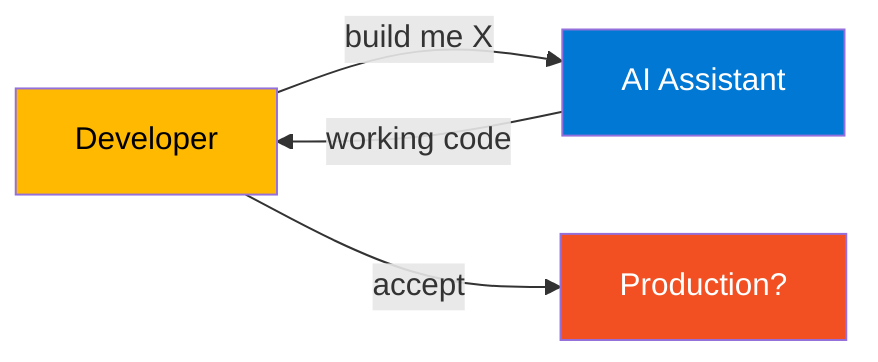

The problem is that "code that works" is not the same as "code that is correct, secure, maintainable, and aligned with business requirements". An SQL injection works, until someone exploits it.

### 1.2 The Five Stages of AI-Native Development

AI-assisted development has evolved through distinct stages, each with increasing maturity in predictability and quality.


Each stage solves limitations of the previous one:

| Stage | Characteristic | Advantage | Risk |
|-------|----------------|-----------|------|
| **AI Assistant** | Inline suggestions, supercharged autocomplete | Speeds up typing | Uncritical acceptance |
| **Vibe Coding** | Fast generation through conversational prompts | Massive speed | Spaghetti code, technical debt |
| **Prompt Engineering** | Systematic prompt refinement | Better results | Inconsistency between sessions |
| **Context Engineering** | Structured context management | Architectural coherence | Operational complexity |
| **Spec-Driven Development** | Specification as executable source of truth | Total predictability | Larger upfront investment |

### 1.3 The Four Risks of Vibe Coding

Quantitative studies document the specific risks of vibe coding in production.

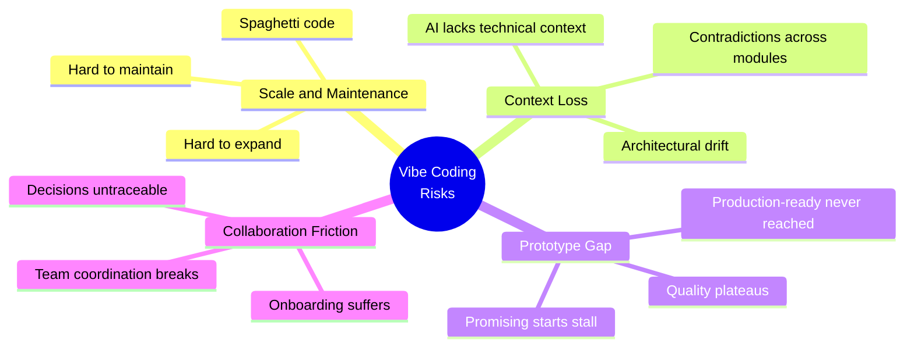

**Risk 1: Scale and Maintenance.** Spaghetti code makes systems hard to maintain and expand. As the codebase grows, vibe coding produces code with low cohesion, high coupling, and inconsistent structure.

**Risk 2: Context Loss.** AI lacks sustained technical context, causing contradictions across modules. Without an external source of truth, design decisions in Sprint 1 are forgotten by Sprint 5.

**Risk 3: Prototype Gap.** Promising starts stall before reaching production-ready state. The famous "demo-grade vs production-grade" gap.

**Risk 4: Collaboration Friction.** Decisions become untraceable, hindering team coordination. Why was this library chosen? Why this approach? Without specs, nobody knows.

**Empirical evidence:**

- Pearce et al. demonstrated that GitHub Copilot produces vulnerable code in **40% of security-relevant scenarios**
- Liu et al. (2026), in a study of 31,132 agent skills, found that **26.1% contain at least one security vulnerability**
- Becker et al. (2025) observed that experienced devs were **19% slower** when allowed to use AI on complex projects
- In an agentic system deployed in an issue tracker, only **8% of invocations resulted in complete success** (merged PR)

### 1.4 Why Professionals Don't Vibe

Qualitative research with 99 experienced developers (Huang et al., 2025) revealed a clear pattern: **professionals do not vibe code**. They **control** agents through planning and active supervision.

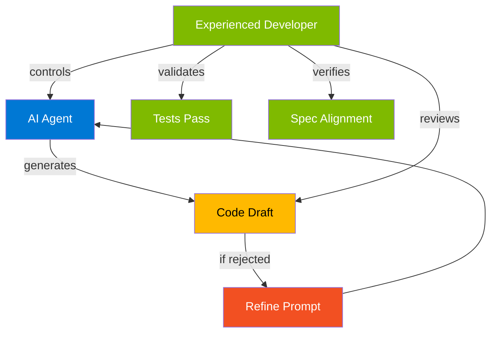

The **four reasons to reject vibe coding** in production:

1. **Engineering principles matter.** Experienced devs value quality attributes (correctness, readability, modularity, maintainability) that are difficult to automatically implant in agents through prompts alone.
2. **Production software has real stakeholders.** Unlike "throwaway weekend projects", production code affects real users and involves other stakeholders who define requirements and architecture.
3. **Familiar codebases have little room for exploration.** When the dev already knows the code, delegating implementation to the agent often leads to frustrating iterations.
4. **Failures in unfamiliar domains consume too much time.** When agentic solutions go wrong in unknown areas, "it can take a lot of time to resolve them" (S13).

The conclusion is direct: **human expertise, when available, supersedes vibes and drives the development of quality software**. SDD is the structure that codifies this expertise so the AI can follow it.

---

## 2. Spec-Driven Development (SDD): Foundations

### 2.1 What SDD Is: Operational Definition

Spec-Driven Development **flips the script** on traditional software development. For decades, code was king: specifications were just scaffolding we built and discarded once the "real work" of coding began.

SDD changes this: **specifications become executable**, directly generating working implementations rather than just guiding them.

The operational definition is precise: you create clear and detailed specifications **before** writing application code. The spec drives the entire development flow.

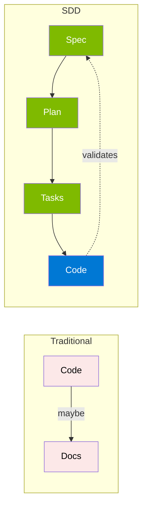

This is the essence: **the spec is a contract for how your code should behave and becomes the source of truth that your tools and AI agents use to generate, test, and validate code**. The result is less guesswork, fewer surprises, and higher-quality code.

### 2.2 The Fundamental Inversion: Intent Is the Source of Truth

The most important cultural shift in SDD is moving from "code is the source of truth" to "**intent is the source of truth**".

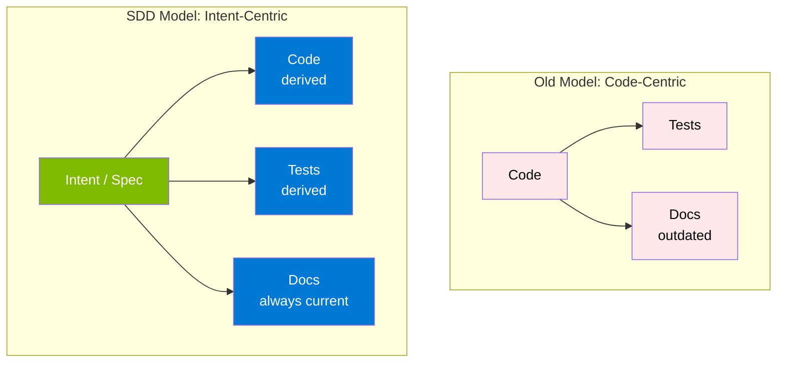

This shift has three practical consequences:

**1. Versioned specs replace outdated documentation.** The spec lives in the repository, is versioned via Git, and any change requires updating the spec first. There is no more "documentation that nobody updates".

**2. Reviews happen at the spec layer.** It is much cheaper to fix an ambiguous specification than to fix 500 lines of code generated from it. Pull requests focus first on "is what we are asking for correct?" before "is what was generated correct?".

**3. AI agents have persistent context.** Instead of re-explaining requirements with every prompt, the spec serves as durable context consulted by the agent. Each new feature begins by reading the constitution and relevant specs.

### 2.3 The Four Phases of the Core Process

SDD organizes development into four sequential, well-defined phases. Each phase has an owner and a specific output.

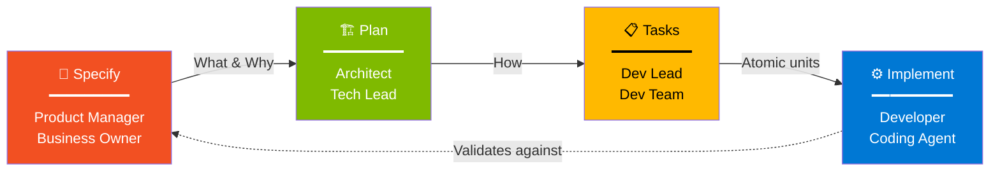

**Phase 1 - Specify (What and Why).** Defines user stories, goals, success criteria, scope, and dependencies. The focus is the user problem, not the technical solution.

**Phase 2 - Plan (How).** Designs architecture, chooses tech stack, defines data model, specifies APIs, performance, and security. The focus is the technical approach.

**Phase 3 - Task (Decomposition).** Breaks the plan into atomic, executable, traceable tasks. Each task has clear input, clear output, and acceptance criteria.

**Phase 4 - Implement (Execution).** Executes tasks and continuously validates against the spec. This is where TDD, continuous validation, and review come in.

### 2.4 Anatomy of a Specification

A well-formed spec has specific components. Here is the template:

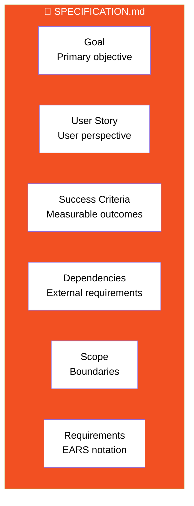

**Real example of a spec.md:**

```markdown
# Feature: User Authentication System

## Goal
Enable users to securely create accounts, log in, and manage sessions
using industry-standard authentication patterns.

## User Stories

### US-001: Account Creation
As a new visitor,
I want to create an account with my email and password,
So that I can access personalized features.

### US-002: Login
As a registered user,
I want to log in with my credentials,
So that I can access my account.

### US-003: Password Reset
As a user who forgot my password,
I want to reset it via email,
So that I can regain access without contacting support.

## Success Criteria
- Account creation completes in under 3 seconds
- Login completes in under 1 second
- Zero plaintext passwords in storage
- 100% of failed logins are logged with correlation IDs

## Scope
### In Scope
- Email + password authentication
- Email verification
- Password reset via email
- JWT-based sessions

### Out of Scope (this iteration)
- Social login (Google, GitHub)
- 2FA / MFA
- Biometric authentication
- SSO

## Dependencies
- SMTP service for email delivery
- PostgreSQL for user storage
- Redis for session management

## Requirements (EARS notation)

REQ-001 [Ubiquitous]: The system shall hash all passwords using bcrypt 
with cost factor 12 before storage.

REQ-002 [Event-driven]: When a user submits a registration form, the 
system shall validate the email format, check for uniqueness, and create 
the account within 3 seconds.

REQ-003 [State-driven]: While a user session is active, the system shall 
refresh the JWT token if it expires within 5 minutes.

REQ-004 [Unwanted]: If login fails 5 times within 15 minutes, then the 
system shall lock the account for 30 minutes and send an email alert.

REQ-005 [Optional]: Where the user has email verification pending, the 
system shall display a banner prompting verification.
```

### 2.5 Anatomy of a Plan

The plan translates the **what** of the spec into the **how** of technology.

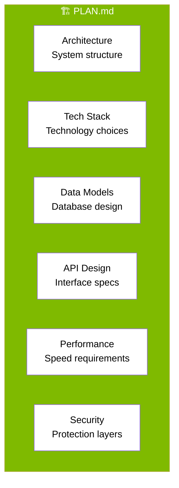

**Real example of plan.md (excerpt):**

````markdown
# Implementation Plan: User Authentication System

## Architecture

```
┌──────────────┐     ┌──────────────┐     ┌──────────────┐
│   Browser    │────▶│   FastAPI    │────▶│  PostgreSQL  │
│  (React SPA) │     │   Backend    │     │   (users)    │
└──────────────┘     └──────────────┘     └──────────────┘
                            │
                            ▼
                     ┌──────────────┐
                     │    Redis     │
                     │  (sessions)  │
                     └──────────────┘
```

## Tech Stack

| Layer    | Technology      | Version | Rationale                       |
|----------|-----------------|---------|---------------------------------|
| Backend  | FastAPI         | 0.100+  | OAuth2 native, Pydantic         |
| ORM      | SQLAlchemy      | 2.0     | Parameterized queries (CWE-89)  |
| Auth     | python-jose     | 3.3+    | RFC 7519 JWT                    |
| Hashing  | passlib+bcrypt  | 1.7+    | Adaptive hashing                |
| Cache    | Redis           | 7.x     | Session storage, rate limiting  |
| Database | PostgreSQL      | 15      | ACID compliance                 |
| Frontend | React           | 18      | JSX auto-escaping (CWE-79)      |

## Data Models

### Users Table
```sql
CREATE TABLE users (
    id UUID PRIMARY KEY DEFAULT gen_random_uuid(),
    email VARCHAR(255) UNIQUE NOT NULL,
    password_hash VARCHAR(60) NOT NULL,
    email_verified BOOLEAN DEFAULT FALSE,
    failed_login_count INT DEFAULT 0,
    locked_until TIMESTAMP NULL,
    created_at TIMESTAMP DEFAULT NOW(),
    updated_at TIMESTAMP DEFAULT NOW()
);

CREATE INDEX idx_users_email ON users(email);
```

## API Design

### POST /auth/register
**Request:**
```json
{
  "email": "user@example.com",
  "password": "SecurePass123!"
}
```
**Response (201):**
```json
{
  "user_id": "uuid",
  "email": "user@example.com",
  "verification_required": true
}
```

### POST /auth/login
**Request:**
```json
{
  "email": "user@example.com",
  "password": "SecurePass123!"
}
```
**Response (200):**
```json
{
  "access_token": "eyJ...",
  "refresh_token": "eyJ...",
  "expires_in": 900
}
```

## Security Requirements
- All passwords hashed with bcrypt cost=12
- JWT tokens expire in 15 minutes
- Refresh tokens expire in 7 days
- Rate limit: 5 login attempts per IP per minute
- All endpoints require HTTPS in production
````

### 2.6 Anatomy of Tasks

Tasks are atomic, executable units derived from the plan.

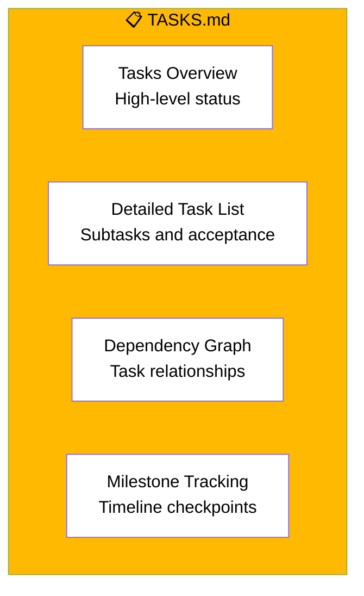

**Example tasks.md with dependencies and parallel markers:**

````markdown
# Tasks: User Authentication System

## Phase 1: Foundation (Sequential)

### T001: Setup database schema
- **File:** `migrations/001_create_users.sql`
- **Output:** Users table created with all indexes
- **Depends on:** None
- **Acceptance:** Migration runs cleanly, schema matches plan

### T002: Setup FastAPI project structure
- **File:** `app/main.py`, `app/config.py`
- **Output:** Running FastAPI server with health endpoint
- **Depends on:** None
- **Acceptance:** `curl /health` returns 200

## Phase 2: Authentication Core (Parallel after T001, T002)

### T003 [P]: Implement password hashing utility
- **File:** `app/core/security.py`
- **Output:** `hash_password()` and `verify_password()` functions
- **Depends on:** T002
- **Acceptance:** Unit tests pass, bcrypt cost=12 verified

### T004 [P]: Implement JWT token generation
- **File:** `app/core/jwt.py`
- **Output:** `create_access_token()` and `verify_token()` functions  
- **Depends on:** T002
- **Acceptance:** Tokens have correct expiry, signature valid

### T005 [P]: Define User model and schemas
- **File:** `app/models/user.py`, `app/schemas/auth.py`
- **Output:** SQLAlchemy User model and Pydantic schemas
- **Depends on:** T001
- **Acceptance:** Schema validation rejects malformed input

## Phase 3: Endpoints (Sequential after Phase 2)

### T006: Register endpoint with TDD
- **File:** `app/api/auth.py::register`
- **Output:** POST /auth/register endpoint
- **Depends on:** T003, T005
- **TDD steps:**
  1. Write test for successful registration → RED
  2. Write test for duplicate email → RED  
  3. Write test for invalid email → RED
  4. Implement endpoint → GREEN
  5. Refactor for clarity
- **Acceptance:** All tests pass, manual smoke test succeeds

### T007: Login endpoint with TDD
- **File:** `app/api/auth.py::login`
- **Output:** POST /auth/login endpoint
- **Depends on:** T003, T004, T006
- **TDD steps:**
  1. Write test for successful login → RED
  2. Write test for wrong password → RED
  3. Write test for account lockout after 5 failures → RED
  4. Implement endpoint → GREEN
  5. Refactor
- **Acceptance:** All tests pass, rate limiting verified

## Dependency Graph
```
T001 ──┬──▶ T005 ──┐
       │           ├──▶ T006 ──▶ T007
T002 ──┼──▶ T003 ──┤
       │           │
       └──▶ T004 ──┘
```
````

The `[P]` markers indicate tasks that can run in parallel. Explicit dependencies ensure correct execution order.

### 2.7 Benefits and Business Value

SDD adoption delivers four categories of measurable benefits:

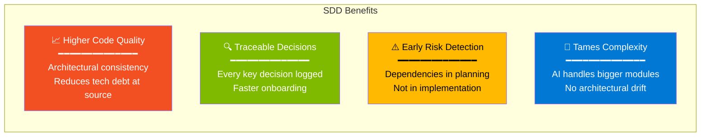

**Impact metrics** (Constitutional SDD case study):

| Metric | Without SDD | With SDD | Improvement |
|--------|-------------|----------|-------------|
| Security defects detected | 11 | 3 | **73% reduction** |
| Time to first secure build | 9 days | 4 days | **56% faster** |
| Compliance documentation coverage | 23% | 100% | **4.3x coverage** |
| Security review iterations | 4 | 1 | **75% reduction** |
| Lines of security code | 612 | 847 | **38% more thorough** |

---

## 3. Test-Driven Development (TDD): Foundations

### 3.1 The Red-Green-Refactor Cycle

TDD is an engineering discipline where tests are written **before** production code. The classic cycle has three short phases:

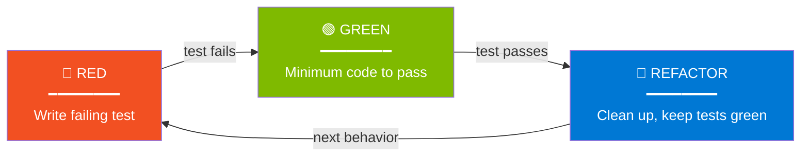

**RED.** Write a failing test. The test expresses the desired behavior that does not yet exist. If it does not fail, the test is wrong or the behavior already exists.

**GREEN.** Write the **minimum** code necessary for the test to pass. No optimization, no extra features. Resist the temptation to add logic that is not being tested.

**REFACTOR.** Clean up the code while keeping all tests green. Improve design, remove duplication, rename for clarity. **Never** add behavior here.

### 3.2 Anatomy of a Test

Every well-written test follows the **Arrange-Act-Assert** pattern (also called Given-When-Then):

```python
def test_user_can_register_with_valid_credentials():
    # ARRANGE (Given): set up the test context
    db = create_test_database()
    user_data = {
        "email": "alice@example.com",
        "password": "SecurePass123!"
    }
    
    # ACT (When): execute the behavior being tested
    response = register_user(db, user_data)
    
    # ASSERT (Then): verify the expected outcome
    assert response.status_code == 201
    assert response.json()["email"] == "alice@example.com"
    assert "user_id" in response.json()
    
    # Side effect verification
    user_in_db = db.query(User).filter_by(email="alice@example.com").first()
    assert user_in_db is not None
    assert user_in_db.password_hash != "SecurePass123!"  # Hashed!
```

**Best practices for tests:**

- **One concept per test.** Do not test login AND logout in the same test
- **Descriptive name.** `test_login_fails_with_wrong_password` (not `test_login_2`)
- **Independent.** Tests should not depend on execution order
- **Fast.** Unit tests should run in milliseconds
- **Deterministic.** Same input = same result, always

### 3.3 TDD in the AI Era

The combination of TDD with AI agents produces a particularly powerful pattern. Agents are extremely good at writing tests based on acceptance criteria, and at implementing code to make tests pass.

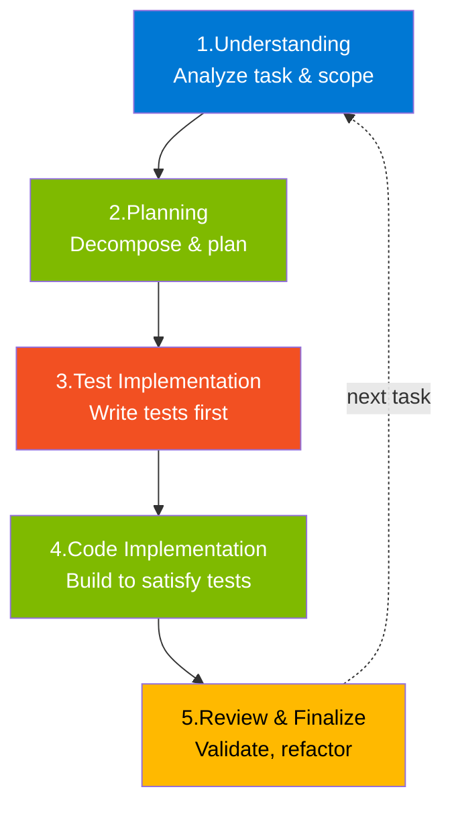

**Why TDD works exceptionally well with AI:**

- **Tests are executable specifications.** The agent has objective "done" criteria
- **Immediate feedback loop.** Failing test = clear signal of what to fix
- **Reduces hallucination.** The agent cannot "invent" behavior if there are tests constraining it
- **Living documentation.** Anyone reading the codebase understands expected behavior

**Empirical research** (Huang et al., 2025): of 99 experienced developers surveyed, agents were considered **suitable for writing tests at a 19:2 favorable ratio**. When combined with agents, TDD naturally becomes "part of the workflow".

**Example agentic TDD prompt:**

```text
> Implement the POST /auth/login endpoint following TDD:
> 
> 1. First, write tests for the following scenarios:
>    - Login with valid credentials returns 200 and JWT
>    - Login with non-existent email returns 401
>    - Login with wrong password returns 401
>    - After 5 failures within 15min, returns 423 (locked)
> 
> 2. Confirm that ALL tests fail (RED)
> 
> 3. Implement the minimum endpoint to make all of them pass (GREEN)
> 
> 4. Refactor for clarity, keeping all tests green
> 
> Use FastAPI, SQLAlchemy, and python-jose per the plan.
```

### 3.4 Property-Based Testing

For systems that need stronger guarantees than example cases allow, **property-based testing** (PBT) is the next evolution.

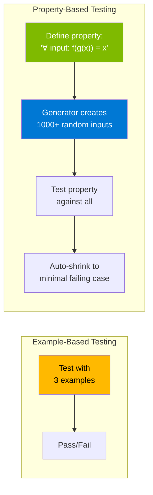

Instead of testing specific examples, you define **invariant properties** that must be true for all valid inputs, and the tool automatically generates hundreds or thousands of test cases.

**Example: testing a base64 encoding/decoding function**

```python
# Example-based (fragile)
def test_base64_specific():
    assert decode(encode("hello")) == "hello"
    assert decode(encode("world")) == "world"
    # And all other cases? Good luck.

# Property-based (robust)
from hypothesis import given, strategies as st

@given(st.text())
def test_base64_roundtrip_is_identity(s):
    """For any string s, decode(encode(s)) must equal s."""
    assert decode(encode(s)) == s
    # Hypothesis generates 100+ random strings including:
    # - Empty strings
    # - Strings with Unicode
    # - Very long strings
    # - Strings with special characters
    # - Edge cases you would NEVER think of
```

Specky integrates PBT directly via `sdd_generate_pbt`, supporting `fast-check` (TypeScript) and `Hypothesis` (Python). The tool extracts five categories of properties from EARS requirements:

| Category | Example |
|----------|---------|
| **Invariants** | Account balance is never negative |
| **Round-trips** | encode + decode = identity |
| **Idempotence** | save(save(x)) = save(x) |
| **State transitions** | draft → submitted (valid); submitted → draft (invalid) |
| **Negative properties** | Function NEVER returns null for valid input |

### 3.5 The Modern Test Pyramid

Not every test is equal. The test pyramid guides distribution among types:

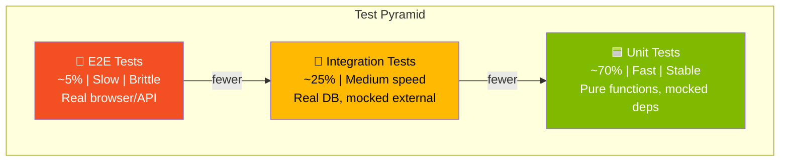

**Recommended distribution:**

| Type | % of Total | Speed | What it tests |
|------|------------|-------|---------------|
| **Unit** | 70% | < 10ms | Isolated logic, pure functions |
| **Integration** | 25% | < 1s | Components together, real DB |
| **E2E** | 5% | 5-30s | Complete flows via UI/API |

**Property-Based Tests** can be added at any level, but are especially valuable at the unit level, where speed allows thousands of executions.

---

## 4. SDD + TDD: The Winning Combination

### 4.1 How SDD and TDD Complement Each Other

SDD and TDD operate at different layers of development, and therefore complement each other perfectly rather than competing.

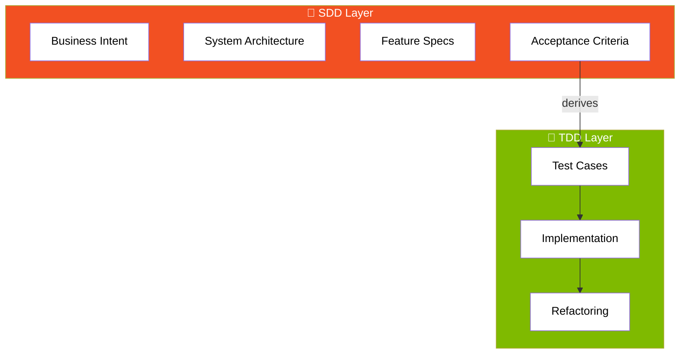

| Dimension | SDD | TDD |
|-----------|-----|-----|
| **Granularity** | Feature, system, architecture | Function, class, behavior |
| **Who writes** | PM, architect, dev lead | Developer, coding agent |
| **When** | Before the technical plan | Before implementation |
| **Artifact** | spec.md, plan.md, tasks.md | Test files (vitest, pytest, etc) |
| **Validation** | Cross-artifact analysis | Test execution |
| **Question it answers** | "What and why to build?" | "How do we know it works?" |
| **Focus** | Alignment with intent | Technical correctness |
| **Failures detected** | Ambiguous spec, inconsistent design | Bugs, regressions |

### 4.2 Integrated SDD + TDD Workflow

The recommended flow combines SDD to define the work and TDD to implement it with quality:

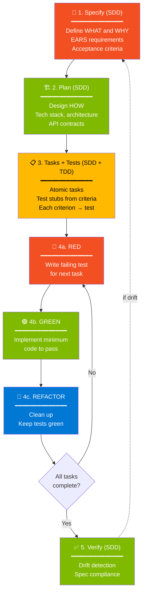

**The genius of this combination:** the spec ensures you are building the right thing, and the tests ensure you are building the right thing **correctly**.

### 4.3 End-to-End Example

Let us walk through the complete flow for a single requirement:

**Step 1 - SDD: Spec defines the criterion**

```markdown
REQ-004 [Unwanted]: If login fails 5 times within 15 minutes, then the 
system shall lock the account for 30 minutes and send an email alert.
```

**Step 2 - SDD: Plan defines how**

```markdown
## Account Lockout Implementation
- Track failed_login_count in users table
- Track locked_until timestamp
- Use Redis for sliding 15-min window counter
- SMTP via SendGrid for alert emails
- Endpoint behavior:
  - Login attempt with failed count = 5 → lock account, set locked_until = now + 30min
  - Login attempt while locked → 423 Locked response
  - Successful login resets counter to 0
```

**Step 3 - SDD: Task defines the unit**

```markdown
### T010: Implement account lockout
- File: `app/api/auth.py::_check_lockout`, `app/services/email.py::send_lockout_alert`
- Depends on: T007 (login endpoint)
- TDD steps:
  1. Test: 5th failure within 15min locks account
  2. Test: locked account returns 423
  3. Test: lockout email is sent
  4. Test: successful login resets counter
- Acceptance: All tests pass; manual smoke test verifies email
```

**Step 4a - TDD: RED (failing tests)**

```python
# tests/test_auth.py
import pytest
from datetime import datetime, timedelta

def test_account_locks_after_5_failures(client, db):
    # Arrange
    create_user(db, "alice@example.com", "correct_password")
    
    # Act: 4 failures
    for _ in range(4):
        response = client.post("/auth/login", json={
            "email": "alice@example.com",
            "password": "wrong"
        })
        assert response.status_code == 401  # Unauthorized, not locked
    
    # 5th failure should lock
    response = client.post("/auth/login", json={
        "email": "alice@example.com",
        "password": "wrong"
    })
    
    # Assert
    assert response.status_code == 423  # Locked
    user = db.query(User).filter_by(email="alice@example.com").first()
    assert user.locked_until > datetime.utcnow()
    assert user.locked_until <= datetime.utcnow() + timedelta(minutes=30)


def test_locked_account_rejects_even_correct_password(client, db):
    # Arrange
    user = create_locked_user(db, "alice@example.com", "correct_password")
    
    # Act
    response = client.post("/auth/login", json={
        "email": "alice@example.com",
        "password": "correct_password"
    })
    
    # Assert
    assert response.status_code == 423
    assert "locked" in response.json()["detail"].lower()


def test_successful_login_resets_failure_counter(client, db):
    # Arrange
    user = create_user_with_failures(db, "alice@example.com", "correct", count=3)
    
    # Act
    response = client.post("/auth/login", json={
        "email": "alice@example.com",
        "password": "correct"
    })
    
    # Assert
    assert response.status_code == 200
    db.refresh(user)
    assert user.failed_login_count == 0
```

Run `pytest`. All fail. **RED confirmed.**

**Step 4b - TDD: GREEN (minimum implementation)**

```python
# app/api/auth.py
from datetime import datetime, timedelta
from fastapi import APIRouter, Depends, HTTPException, status

router = APIRouter()
LOCKOUT_THRESHOLD = 5
LOCKOUT_DURATION = timedelta(minutes=30)

@router.post("/auth/login")
async def login(credentials: LoginRequest, db: Session = Depends(get_db)):
    user = db.query(User).filter_by(email=credentials.email).first()
    
    # Check if account is locked
    if user and user.locked_until and user.locked_until > datetime.utcnow():
        raise HTTPException(
            status_code=status.HTTP_423_LOCKED,
            detail="Account is locked. Try again later."
        )
    
    # Verify password
    if not user or not verify_password(credentials.password, user.password_hash):
        if user:
            user.failed_login_count += 1
            if user.failed_login_count >= LOCKOUT_THRESHOLD:
                user.locked_until = datetime.utcnow() + LOCKOUT_DURATION
                db.commit()
                send_lockout_alert(user.email)
            db.commit()
        raise HTTPException(
            status_code=status.HTTP_401_UNAUTHORIZED,
            detail="Invalid credentials"
        )
    
    # Successful login: reset counter
    user.failed_login_count = 0
    user.locked_until = None
    db.commit()
    
    return {
        "access_token": create_access_token({"sub": str(user.id)}),
        "token_type": "bearer",
        "expires_in": 900
    }
```

Run `pytest`. All pass. **GREEN confirmed.**

**Step 4c - TDD: REFACTOR (clean up while green)**

```python
# Refactor: extract lockout logic to private method
async def _handle_failed_login(user: User, db: Session) -> None:
    """Increment failure counter and lock account if threshold reached."""
    user.failed_login_count += 1
    if user.failed_login_count >= LOCKOUT_THRESHOLD:
        user.locked_until = datetime.utcnow() + LOCKOUT_DURATION
        send_lockout_alert(user.email)
    db.commit()


async def _is_account_locked(user: User) -> bool:
    """Check if user's account is currently locked."""
    return user.locked_until is not None and user.locked_until > datetime.utcnow()


@router.post("/auth/login")
async def login(credentials: LoginRequest, db: Session = Depends(get_db)):
    user = db.query(User).filter_by(email=credentials.email).first()
    
    if user and await _is_account_locked(user):
        raise HTTPException(status_code=status.HTTP_423_LOCKED, detail="Account locked")
    
    if not user or not verify_password(credentials.password, user.password_hash):
        if user:
            await _handle_failed_login(user, db)
        raise HTTPException(status_code=status.HTTP_401_UNAUTHORIZED, detail="Invalid credentials")
    
    user.failed_login_count = 0
    user.locked_until = None
    db.commit()
    
    return _generate_token_response(user)
```

Run `pytest`. All still pass. **REFACTOR complete.**

**Step 5 - SDD: Verify (drift check)**

```text
> Run sdd_check_sync to verify implementation matches REQ-004
```

Specky compares code vs spec and confirms alignment. No drift detected.

---

## 5. EARS Notation: Writing Requirements That Work

### 5.1 Why EARS Exists

EARS (Easy Approach to Requirements Syntax) was proposed by Mavin et al. in 2009 as a solution to an old problem: software requirements are frequently vague, ambiguous, or incomplete.

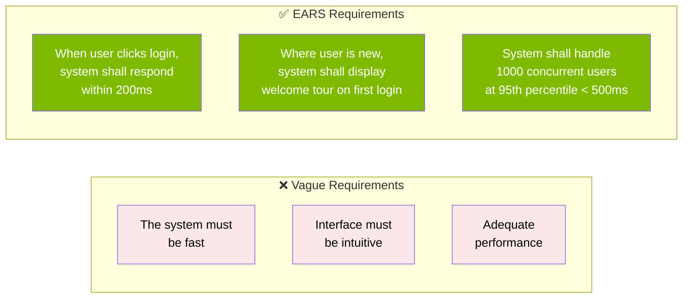

EARS forces precision through **6 structured patterns**. Each pattern has a syntactic form that eliminates ambiguity.

### 5.2 The 6 EARS Patterns Explained

```mermaid
mindmap
  root((6 EARS<br/>Patterns))
    Ubiquitous
      "The system shall..."
      Always true behavior
    Event-driven
      "When [event], the system shall..."
      Reaction to discrete events
    State-driven
      "While [state], the system shall..."
      Behavior during states
    Optional
      "Where [feature], the system shall..."
      Conditional features
    Unwanted
      "If [condition], then the system shall..."
      Error handling
    Complex
      "While [state], when [event]..."
      Combinations
```

Detailed table with use cases:

| Pattern | Syntax | When to Use | Example |
|---------|--------|-------------|---------|
| **Ubiquitous** | The system shall... | Always-true behavior, invariants | The system shall encrypt all data at rest using AES-256 |
| **Event-driven** | When [event], the system shall... | Response to discrete events (clicks, requests, messages) | When a user submits the login form, the system shall validate credentials within 200ms |
| **State-driven** | While [state], the system shall... | Behavior during sustained periods | While in maintenance mode, the system shall return 503 to all requests |
| **Optional** | Where [feature/condition], the system shall... | Conditional or optional features | Where 2FA is enabled, the system shall require OTP after password verification |
| **Unwanted** | If [condition], then the system shall... | Error handling, exceptional cases | If session expires, then the system shall redirect user to /login |
| **Complex** | While [state], when [event], the system shall... | Combinations of the above | While processing payment, when timeout occurs, the system shall queue retry |

### 5.3 Anti-Patterns: What NOT to Write

Most bad requirements fall into recognizable patterns. Recognizing them is the first step to avoiding them.

| Anti-Pattern | Bad Example | Why It Is Bad | EARS Version |
|--------------|-------------|---------------|--------------|
| **Vague Subjective** | "System should be friendly" | Impossible to test | "When user makes an error, system shall display message in plain language" |
| **Unquantifiable Adverb** | "Must be fast" | "Fast" for whom? | "System shall respond to login requests within 200ms at p95" |
| **Multiple Requirements** | "System must authenticate and log and send email" | We do not know what failed if it fails | Three separate requirements, one per line |
| **Solution Instead of Requirement** | "System must use Redis" | Implementation constraint | "System shall cache session data with sub-10ms read latency" |
| **Leaked Implementation** | "API must return JSON with 'token' field" | Couples to format | "Successful login shall return access token to client" |
| **Negative Without Bounds** | "System should not be slow" | How do we know it is slow? | "System shall complete X within Y seconds" |

### 5.4 Converting Vague Requirements to EARS

Real conversions from vague requirements to well-formed EARS:

**Example 1: Input validation**

```text
❌ VAGUE:
"The system must validate user data correctly."

✅ EARS:
REQ-V01 [Event-driven]: When a user submits the registration form, 
the system shall validate that email matches RFC 5322 format and 
return validation error within 100ms if invalid.

REQ-V02 [Event-driven]: When a user submits a password, the system 
shall require minimum 8 characters with at least one number, one 
uppercase, and one special character.

REQ-V03 [Unwanted]: If validation fails, then the system shall return 
HTTP 422 with field-specific error messages, without exposing 
internal validation logic.
```

**Example 2: Performance**

```text
❌ VAGUE:
"System must have good performance."

✅ EARS:
REQ-P01 [Ubiquitous]: The system shall serve API responses with p50 
latency under 100ms and p99 under 500ms.

REQ-P02 [State-driven]: While under load of 10,000 concurrent users, 
the system shall maintain 99.9% availability.

REQ-P03 [Event-driven]: When response time exceeds 1 second, the 
system shall log a performance warning with full request context.
```

**Example 3: Security**

```text
❌ VAGUE:
"System must be secure."

✅ EARS:
REQ-S01 [Ubiquitous]: The system shall hash all passwords using bcrypt 
with cost factor 12 before storage.

REQ-S02 [Ubiquitous]: The system shall encrypt all sensitive data at 
rest using AES-256-GCM.

REQ-S03 [Ubiquitous]: The system shall transmit all data over TLS 1.2 
or higher.

REQ-S04 [Event-driven]: When a user authenticates successfully, the 
system shall issue a JWT token with 15-minute expiration.

REQ-S05 [Unwanted]: If 5 login attempts fail within 15 minutes, then 
the system shall lock the account for 30 minutes.

REQ-S06 [Optional]: Where the user has 2FA enabled, the system shall 
require TOTP verification after password validation.
```

**Specky's EARS validator** programmatically checks every requirement against these patterns. Vague terms like "fast", "good", "easy", "intuitive" are automatically flagged.

---

## 6. GitHub Spec-Kit: The Open Source Methodology

### 6.1 Overview

[Spec-Kit](https://github.com/github/spec-kit) is GitHub's official open-source toolkit for Spec-Driven Development. Released as part of the GitHub Copilot ecosystem, it provides templates, slash commands, and scripts that structure the SDD workflow in any supported AI agent.

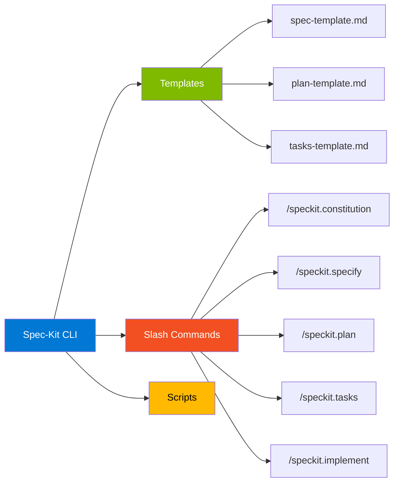

The Spec-Kit premise is simple: instead of every team inventing their own spec structure, there is a validated and extensible standard that works with **more than 30 AI agents**:

- Claude Code, Claude Desktop
- GitHub Copilot
- Cursor, Windsurf, Junie
- Gemini CLI, Codex CLI, Qwen Code, Kimi Code
- Cline, Roo Code, Kilo Code
- Goose, Auggie CLI, Forge
- And many others

**Current project metrics** (2026):

- **88,000+ stars** on GitHub
- **7,600+ forks**
- **129 releases**
- **60+ community extensions**
- Support for 30+ AI agents

### 6.2 Detailed Installation

The recommended installation uses `uv` (modern Python package manager) with version pinning for stability.

**Prerequisites:**

- Linux/macOS/Windows
- Python 3.11+
- Git
- [uv](https://docs.astral.sh/uv/) for package management
- A supported AI agent

**Option 1: Persistent Installation (Recommended)**

```bash
# Install pinned version (recommended)
uv tool install specify-cli --from git+https://github.com/github/spec-kit.git@v0.7.0

# Or install latest from main (may include unreleased changes)
uv tool install specify-cli --from git+https://github.com/github/spec-kit.git
```

**Option 2: One-Time Use (no install)**

```bash
# Create new project
uvx --from git+https://github.com/github/spec-kit.git@v0.7.0 specify init my-project

# Initialize in current directory
uvx --from git+https://github.com/github/spec-kit.git@v0.7.0 specify init . --ai claude
```

**Option 3: Air-Gapped (corporate environments)**

For environments that block PyPI or GitHub access, use `pip download` to create portable bundles. See the [Enterprise Installation Guide](https://github.com/github/spec-kit/blob/main/docs/installation.md#enterprise--air-gapped-installation).

**Verify installation:**

```bash
specify check
```

**Basic CLI commands:**

| Command | Description |
|---------|-------------|
| `specify init <PROJECT>` | Create new project |
| `specify init .` | Initialize in current directory |
| `specify init --here` | Same as `init .` |
| `specify check` | Verify installed tools |
| `specify version` | Show installed version |
| `specify extension` | Manage extensions |
| `specify preset` | Manage presets |

**Important `init` options:**

| Option | Description |
|--------|-------------|
| `--ai <agent>` | Specifies agent (claude, copilot, cursor-agent, etc) |
| `--script sh\|ps` | Script variant (bash or PowerShell) |
| `--no-git` | Skips Git repository initialization |
| `--force` | Merges into non-empty directory without confirmation |
| `--ai-skills` | Installs templates as agent skills (modern format) |
| `--branch-numbering sequential\|timestamp` | Branch numbering strategy |

### 6.3 Spec-Kit Slash Commands

After `specify init`, your AI agent gains access to structured slash commands. The commands follow the `/speckit.*` pattern (or `$speckit-*` in Codex CLI in skills mode).

```mermaid
flowchart TB
    subgraph Core["Core Commands (essential)"]
    A1["/speckit.constitution<br/>Governing principles"]
    A2["/speckit.specify<br/>Define what to build"]
    A3["/speckit.plan<br/>Technical plan"]
    A4["/speckit.tasks<br/>Task list"]
    A5["/speckit.implement<br/>Execute tasks"]
    A6["/speckit.taskstoissues<br/>Tasks → GitHub Issues"]
    end
    subgraph Optional["Optional Commands (quality)"]
    B1["/speckit.clarify<br/>Resolve ambiguities"]
    B2["/speckit.analyze<br/>Cross-artifact analysis"]
    B3["/speckit.checklist<br/>Quality checklists"]
    end
    A1 --> A2
    A2 --> B1
    B1 --> A3
    A3 --> A4
    A4 --> B2
    B2 --> A5
    A5 --> A6
    style Core fill:#0078D4,color:#fff
    style Optional fill:#7FBA00,color:#fff
```

**Core Commands (essential):**

| Command | Purpose | Output |
|---------|---------|--------|
| `/speckit.constitution` | Creates or updates governing principles | `.specify/memory/constitution.md` |
| `/speckit.specify` | Defines what to build (requirements, user stories) | `specs/NNN-feature/spec.md` |
| `/speckit.plan` | Creates technical plan with chosen stack | `specs/NNN-feature/plan.md` + artifacts |
| `/speckit.tasks` | Generates actionable task list | `specs/NNN-feature/tasks.md` |
| `/speckit.taskstoissues` | Converts tasks into GitHub Issues | Issues created in repo |
| `/speckit.implement` | Executes all tasks | Code + tests implemented |

**Optional Commands (enhanced quality):**

| Command | Purpose | When to Use |
|---------|---------|-------------|
| `/speckit.clarify` | Structured sequence of questions | **Before** `/speckit.plan` |
| `/speckit.analyze` | Cross-artifact consistency analysis | **After** `/speckit.tasks`, before `implement` |
| `/speckit.checklist` | Generates custom quality checklists | Completeness validation |

### 6.4 Step-by-Step Complete Workflow

The Spec-Kit workflow follows 7 sequential steps:

```mermaid
flowchart TB
    A["1. specify init my-project --ai claude"]
    B["2. /speckit.constitution<br/>Define principles"]
    C["3. /speckit.specify<br/>Specify feature"]
    D["4. /speckit.clarify<br/>Resolve ambiguities"]
    E["5. /speckit.plan<br/>Technical plan"]
    F["6. /speckit.tasks<br/>Break into tasks"]
    G["7. /speckit.implement<br/>Execute tasks"]
    A --> B
    B --> C
    C --> D
    D --> E
    E --> F
    F --> G
    style A fill:#0078D4,color:#fff
    style B fill:#F25022,color:#fff
    style C fill:#7FBA00,color:#fff
    style D fill:#FFB900,color:#000
    style E fill:#7FBA00,color:#fff
    style F fill:#FFB900,color:#000
    style G fill:#0078D4,color:#fff
```

### 6.5 Anatomy of a Spec-Kit Project

After running the complete workflow, the project has the following structure:

```
my-project/
├── .specify/
│   ├── memory/
│   │   └── constitution.md          ← Governing principles
│   ├── scripts/
│   │   ├── check-prerequisites.sh
│   │   ├── common.sh
│   │   ├── create-new-feature.sh
│   │   ├── setup-plan.sh
│   │   └── update-claude-md.sh
│   ├── specs/
│   │   ├── 001-create-taskify/
│   │   │   ├── spec.md              ← Functional spec
│   │   │   ├── plan.md              ← Technical plan
│   │   │   ├── tasks.md             ← Task breakdown
│   │   │   ├── research.md          ← Researched technical decisions
│   │   │   ├── data-model.md        ← Data model
│   │   │   ├── contracts/
│   │   │   │   ├── api-spec.json    ← OpenAPI spec
│   │   │   │   └── signalr-spec.md  ← WebSocket protocol
│   │   │   └── quickstart.md        ← Quick setup
│   │   ├── 002-add-search/
│   │   └── 003-payment-integration/
│   └── templates/
│       ├── plan-template.md
│       ├── spec-template.md
│       └── tasks-template.md
├── CLAUDE.md (or GEMINI.md, COPILOT.md, etc - guide for the agent)
├── src/                             ← Application code
├── tests/                           ← Tests
└── README.md
```

**Key structural points:**

- **Numbered branches:** Each feature lives in its own branch (`001-create-taskify`, `002-add-search`)
- **Versioned specs:** Everything in Git, traceable
- **Persistent memory:** The constitution is the project's "DNA", consulted in all phases
- **Customizable templates:** You can override templates for your organization

### 6.6 Constitution: Project Principles

The constitution is the most important document of a Spec-Kit project.

> By analogy with political constitutions that establish founding principles of governance, a **software constitution establishes non-negotiable constraints that govern all subsequent code generation**.

**Example constitution.md:**

```markdown
# Project Constitution: Taskify

## Article 1: Code Quality
- All code must follow PEP 8 (Python) or Prettier defaults (TypeScript)
- No function longer than 50 lines
- No file longer than 500 lines
- Cyclomatic complexity must not exceed 10

## Article 2: Testing Standards
- Minimum 80% code coverage
- All public APIs must have integration tests
- TDD is mandatory for new features
- Tests must run in under 30 seconds total

## Article 3: User Experience Consistency
- All forms use the same validation pattern
- All error messages follow the format: "What went wrong. What to do."
- All loading states show within 100ms of action
- All animations respect prefers-reduced-motion

## Article 4: Performance Requirements
- API p95 latency < 200ms
- First Contentful Paint < 1.5s
- Time to Interactive < 3s on 3G
- Bundle size < 200KB gzipped

## Article 5: Security
- All passwords hashed with bcrypt cost=12
- All endpoints (except /health) require authentication
- All inputs validated with Pydantic/Zod schemas
- Dependencies scanned weekly with Snyk

## Governance
- Changes to this constitution require approval from tech lead
- Constitution version must increment when principles change
- All PRs must include compliance check against constitution
```

**Principles for writing effective constitutions:**

1. **Specificity enables enforcement.** "Use secure practices" does not work. "Hash with bcrypt cost=12" does.
2. **Include rationale.** Explain the "why", not just the "what".
3. **Version it.** Use semver for the constitution. Changes = new version.
4. **Include governance.** Who can approve changes? How?
5. **Do not over-engineer.** Start with 5-10 principles, expand gradually.

### 6.7 Real Example: Building Taskify

Let us follow the complete workflow to build **Taskify**, a Trello-style productivity platform.

**Step 1: Initialize the project**

```bash
specify init taskify --ai claude
cd taskify
```

**Step 2: Establish principles**

```text
> /speckit.constitution Create principles focused on code quality, 
testing standards, user experience consistency, and performance 
requirements. Include governance for how these principles should guide 
technical decisions and implementation choices.
```

This creates `.specify/memory/constitution.md`.

**Step 3: Create functional spec**

```text
> /speckit.specify Develop Taskify, a team productivity platform. It 
should allow users to create projects, add team members, assign tasks, 
comment and move tasks between Kanban-style boards. In this initial 
phase for this feature, let's call it "Create Taskify". Multiple users, 
but the users will be declared ahead of time, predefined. I want five 
users in two different categories: one product manager and four 
engineers. Let's create three different sample projects. Let's have the 
standard Kanban columns for the status of each task: "To Do", "In 
Progress", "In Review", and "Done". There will be no login for this 
application as this is just the very first testing thing to ensure that 
our basic features are set up. For each task in the UI, you should be 
able to change the current status between the columns. Unlimited 
comments per card. User assignment. Cards assigned to you should appear 
in different color. You can edit/delete your own comments, but not 
others'.
```

After this prompt, Claude Code:

- Creates branch `001-create-taskify`
- Generates `specs/001-create-taskify/spec.md`
- Includes user stories, functional requirements, acceptance criteria

**Step 4: Clarify (mandatory before planning)**

```text
> /speckit.clarify
```

The agent asks structured questions like:

- "How many tasks per sample project? Random between which limits?"
- "Do comments have timestamps? Chronological or reverse order?"
- "Should drag-and-drop work on mobile?"

Your answers go into the `Clarifications` section of the spec.

**Step 5: Generate technical plan**

```text
> /speckit.plan We're going to generate this using .NET Aspire, with 
Postgres as the database. The frontend should use Blazor Server with 
drag-and-drop boards and real-time updates. There should be a REST API 
created with projects, tasks, and notifications APIs.
```

This generates multiple artifacts:

- `plan.md`, overview
- `research.md`, technical decisions with research
- `data-model.md`, data model
- `contracts/api-spec.json`, OpenAPI spec
- `contracts/signalr-spec.md`, WebSocket protocol
- `quickstart.md`, local setup guide

**Step 6: Validate the plan**

```text
> Now I want you to audit the implementation plan and the implementation 
detail files. Read through it with an eye on determining whether or not 
there is a sequence of tasks that is obvious. For example, when I look 
at the core implementation, it would be useful to reference the 
appropriate places in the implementation details where it can find the 
information as it walks through each step.
```

This pass refines and eliminates blind spots before implementation.

**Step 7: Generate task breakdown**

```text
> /speckit.tasks
```

Creates `tasks.md` containing:

- Breakdown organized by user story
- Dependency management
- `[P]` markers for parallel execution
- File path specification
- TDD structure (tests before implementation)
- Validation checkpoints

**Step 8: Implementation**

```text
> /speckit.implement
```

The agent:

1. Validates prerequisites (constitution, spec, plan, tasks exist)
2. Parses the task breakdown
3. Executes tasks in correct order, respecting dependencies
4. Runs in parallel where marked `[P]`
5. Follows TDD defined in the plan
6. Provides progress updates
7. Handles errors appropriately

---

## 7. Specky: The MCP Engine for SDD

### 7.1 Overview

[Specky](https://github.com/paulasilvatech/specky) is an open-source MCP (Model Context Protocol) server that turns the SDD methodology from Spec-Kit into a **programmable enforcement engine** with **53 validated tools**.

```mermaid
flowchart LR
    A["📥 Any Input<br/>━━━━━━━━━━<br/>Transcript<br/>PDF/DOCX<br/>Figma<br/>Codebase<br/>Natural language"]
    B["⚙️ Specky Engine<br/>━━━━━━━━━━<br/>53 MCP Tools<br/>10 Phase Pipeline<br/>EARS Validator<br/>Compliance Engine"]
    C["📦 Complete Package<br/>━━━━━━━━━━<br/>Specs, Designs, Tasks<br/>Tests, IaC, Docs<br/>PR-ready code"]
    A --> B
    B --> C
    style A fill:#7FBA00,color:#fff
    style B fill:#0078D4,color:#fff
    style C fill:#F25022,color:#fff
```

The summary phrase is powerful:

> **The AI is the operator, Specky is the engine.** The AI's creativity is channeled through a validated pipeline instead of producing unstructured guesswork.

**Main features:**

- **53 validated MCP tools** with Zod schemas
- **10-phase pipeline** with state machine blocking phase-skipping
- **Programmatic EARS validator** (not AI-tries)
- **Automatic cross-artifact analysis**
- **6 input methods**: natural language, transcripts, PDFs, Figma, codebase, raw text
- **Automatic diagram generation** (17 Mermaid types)
- **Compliance check** for HIPAA, SOC2, GDPR, PCI-DSS, ISO 27001
- **Integrated property-based testing** (fast-check, Hypothesis)
- **MCP-to-MCP routing** for GitHub, Azure DevOps, Jira, Terraform, Figma, Docker

### 7.2 Spec-Kit vs Specky: How They Complement Each Other

The distinction between the two projects is important and frequently misunderstood:

```mermaid
flowchart TB
    subgraph Methodology["📚 Spec-Kit: The Methodology"]
    A1[Templates .md]
    A2[Slash commands]
    A3[Agent definitions]
    A4["AI reads and follows"]
    end
    subgraph Engine["⚙️ Specky: The Engine"]
    B1[53 MCP tools]
    B2[State machine]
    B3[EARS validator]
    B4[Zod schemas]
    end
    A4 -.->|"reimplemented as"| B1
    style Methodology fill:#0078D4,color:#fff
    style Engine fill:#F25022,color:#fff
```

| Aspect | Spec-Kit (Methodology) | Specky (Engine) |
|--------|------------------------|-----------------|
| **What it is** | Prompt templates and agent definitions | MCP server with 53 tools |
| **How it works** | AI reads `.md` templates and follows instructions | AI calls tools that validate, enforce, and generate |
| **Validation** | AI tries to follow the prompts | State machine, EARS regex, Zod schemas |
| **Install** | Copy `.github/agents/` and `.claude/commands/` | `npx specky-sdd` (includes methodology built-in) |
| **Works standalone** | Yes, in any AI IDE | Yes, includes all Spec-Kit patterns |
| **Best for** | Learning SDD, lightweight adoption | Production enforcement, enterprise, compliance |

**💡 Crucial insight:** When you install Specky, you get **the complete Spec-Kit methodology reimplemented as validated MCP tools**. **No separate Spec-Kit installation is required.** But Spec-Kit remains available as a standalone learning tool.

### 7.3 Specky Architecture

```mermaid
flowchart TB
    subgraph Client["AI Client (IDE)"]
    A1[VS Code + Copilot]
    A2[Claude Code]
    A3[Cursor]
    A4[Windsurf]
    end
    subgraph Specky["Specky MCP Server"]
    B1[53 MCP Tools]
    B2[State Machine]
    B3[EARS Validator]
    B4[Template Engine]
    B5[FileManager]
    end
    subgraph External["External MCP Servers"]
    C1[GitHub MCP]
    C2[Azure DevOps MCP]
    C3[Jira MCP]
    C4[Terraform MCP]
    C5[Figma MCP]
    C6[Docker MCP]
    end
    Client --> Specky
    Specky -->|"routes structured JSON"| External
    style Client fill:#7FBA00,color:#fff
    style Specky fill:#0078D4,color:#fff
    style External fill:#F25022,color:#fff
```

The architecture follows 3 layers:

- **Client Layer:** Any IDE with MCP support (VS Code, Claude Code, Cursor, etc)
- **Specky Layer:** The central engine with tools, state machine, validators
- **External Layer:** Other MCP servers for integration (GitHub, Azure DevOps, etc)

**MCP-to-MCP Principle:** Specky outputs structured JSON with routing instructions. Your AI client calls the appropriate external MCP server. No vendor lock-in.

```text
Specky → sdd_export_work_items(platform: "azure_boards") → JSON payload
       → AI Client → Azure DevOps MCP → create_work_item()

Specky → sdd_validate_iac(provider: "terraform") → validation payload
       → AI Client → Terraform MCP → plan/validate

Specky → sdd_figma_to_spec(file_key: "abc123") → Figma request
       → AI Client → Figma MCP → get_design_context()
```

### 7.4 Complete Installation

**Prerequisites:**

- Node.js 18+
- An AI IDE with MCP support

**Per workspace (recommended for teams):**

Create `.vscode/mcp.json` in the repo root:

```json
{
  "servers": {
    "specky": {
      "command": "npx",
      "args": ["-y", "specky-sdd"],
      "env": {
        "SDD_WORKSPACE": "${workspaceFolder}"
      }
    }
  }
}
```

Commit to Git so everyone on the team gets it automatically.

**For Claude Code:**

```bash
claude mcp add specky -- npx -y specky-sdd
```

**For Cursor:**

Settings > MCP Servers:

```json
{
  "specky": {
    "command": "npx",
    "args": ["-y", "specky-sdd"]
  }
}
```

**Global (once, all repos):**

```bash
npm install -g specky-sdd
```

**For Claude Desktop:**

Edit `claude_desktop_config.json` (locations):

| OS | Path |
|----|------|
| macOS | `~/Library/Application Support/Claude/claude_desktop_config.json` |
| Linux | `~/.config/Claude/claude_desktop_config.json` |
| Windows | `%APPDATA%\Claude\claude_desktop_config.json` |

```json
{
  "mcpServers": {
    "specky": {
      "command": "specky-sdd",
      "env": { "SDD_WORKSPACE": "/path/to/your/project" }
    }
  }
}
```

**Docker (HTTP mode, no Node.js required):**

```bash
# Start
docker run -d --name specky -p 3200:3200 \
  -v $(pwd):/workspace \
  ghcr.io/paulasilvatech/specky:latest

# Verify
curl http://localhost:3200/health

# Stop
docker stop specky && docker rm specky
```

**Verify installation:**

Open your AI IDE and type:

```text
> What tools does Specky have?
```

The AI should list all 53 SDD tools.

### 7.5 The 53 Specky Tools by Category

Specky organizes its 53 tools into 12 functional categories:

```mermaid
mindmap
  root((Specky<br/>53 Tools))
    Input/Conversion 5
    Pipeline Core 8
    Quality/Validation 5
    Diagrams 4
    IaC 3
    Dev Environment 3
    Integration 5
    Documentation 4
    Testing 3
    Turnkey 1
    Checkpointing 3
    Utility/Ecosystem 6
```

**📥 Input and Conversion (5 tools)**

| Tool | Description |
|------|-------------|
| `sdd_import_document` | Converts PDF, DOCX, PPTX, TXT, MD to Markdown |
| `sdd_import_transcript` | Parses transcripts (Teams, Zoom, Google Meet) |
| `sdd_auto_pipeline` | Any input → complete spec pipeline |
| `sdd_batch_import` | Processes folder of mixed documents |
| `sdd_figma_to_spec` | Figma design → requirements spec |

**🔄 Pipeline Core (8 tools)**

| Tool | Description |
|------|-------------|
| `sdd_init` | Initializes project with constitution and scope diagram |
| `sdd_discover` | Interactive discovery with stakeholder mapping |
| `sdd_write_spec` | Writes EARS requirements with flow diagrams |
| `sdd_clarify` | Resolves ambiguities with decision tree |
| `sdd_write_design` | 12-section system design (C4 model) |
| `sdd_write_tasks` | Task breakdown with dependency graph |
| `sdd_run_analysis` | Quality gate analysis with coverage heatmap |
| `sdd_advance_phase` | Advances to next pipeline phase |

**✅ Quality and Validation (5 tools)**

| Tool | Description |
|------|-------------|
| `sdd_checklist` | Mandatory quality checklist (security, accessibility) |
| `sdd_verify_tasks` | Detects phantom completions |
| `sdd_compliance_check` | HIPAA, SOC2, GDPR, PCI-DSS, ISO 27001 validation |
| `sdd_cross_analyze` | Spec-design-tasks alignment with consistency score |
| `sdd_validate_ears` | Batch EARS requirement validation |

**📊 Diagrams and Visualization (4 tools, 17 diagram types)**

| Tool | Description |
|------|-------------|
| `sdd_generate_diagram` | Single Mermaid diagram (17 types) |
| `sdd_generate_all_diagrams` | All diagrams for a feature |
| `sdd_generate_user_stories` | User stories with flow diagrams |
| `sdd_figma_diagram` | FigJam-ready diagram via Figma MCP |

**🏗️ Infrastructure as Code (3 tools)**

| Tool | Description |
|------|-------------|
| `sdd_generate_iac` | Terraform/Bicep from architecture design |
| `sdd_validate_iac` | Validation via Terraform MCP + Azure MCP |
| `sdd_generate_dockerfile` | Dockerfile + docker-compose from tech stack |

**💻 Dev Environment (3 tools)**

| Tool | Description |
|------|-------------|
| `sdd_setup_local_env` | Docker-based local dev environment |
| `sdd_setup_codespaces` | GitHub Codespaces configuration |
| `sdd_generate_devcontainer` | `.devcontainer/devcontainer.json` generation |

**🔗 Integration and Export (5 tools)**

| Tool | Description |
|------|-------------|
| `sdd_create_branch` | Git branch naming convention |
| `sdd_export_work_items` | Tasks → GitHub Issues, Azure Boards or Jira |
| `sdd_create_pr` | PR payload with spec summary |
| `sdd_implement` | Ordered implementation plan with checkpoints |
| `sdd_research` | Resolves unknowns in RESEARCH.md |

**📖 Documentation (4 tools)**

| Tool | Description |
|------|-------------|
| `sdd_generate_docs` | Complete auto-documentation |
| `sdd_generate_api_docs` | API documentation from design |
| `sdd_generate_runbook` | Operational runbook |
| `sdd_generate_onboarding` | Developer onboarding guide |

**🧪 Testing (3 tools)**

| Tool | Description |
|------|-------------|
| `sdd_generate_tests` | Test stubs (vitest/jest/playwright/pytest/junit/xunit) |
| `sdd_verify_tests` | Verifies results vs requirements, traceability |
| `sdd_generate_pbt` | Property-based tests with fast-check or Hypothesis |

**⚡ Turnkey, 💾 Checkpointing, 🔧 Utility (13 more tools)**

Additional tools for specialized flows, spec snapshots, metrics, and stack detection.

### 7.6 The 10-Phase Pipeline with LGTM Gates

Every Specky project follows the same 10-phase pipeline. The state machine **blocks phase-skipping**: you cannot jump from Init to Design without completing Specify first.

```mermaid
flowchart LR
    A[1.Init] --> B[2.Discover]
    B --> C[3.Specify]
    C --> D[4.Clarify]
    D --> E[5.Design]
    E --> F[6.Tasks]
    F --> G[7.Analyze]
    G --> H[8.Implement]
    H --> I[9.Verify]
    I --> J[10.Release]
    
    C -.->|"LGTM gate"| C
    E -.->|"LGTM gate"| E
    F -.->|"LGTM gate"| F
    I -.->|"if drift"| C
    
    style A fill:#0078D4,color:#fff
    style B fill:#0078D4,color:#fff
    style C fill:#F25022,color:#fff
    style D fill:#F25022,color:#fff
    style E fill:#7FBA00,color:#fff
    style F fill:#FFB900,color:#000
    style G fill:#FFB900,color:#000
    style H fill:#7FBA00,color:#fff
    style I fill:#7FBA00,color:#fff
    style J fill:#0078D4,color:#fff
```

| Phase | What happens | Required output |
|-------|--------------|-----------------|
| **Init** | Creates structure, constitution, scans codebase | `CONSTITUTION.md` |
| **Discover** | 7 structured questions about scope, users, constraints | Discovery answers |
| **Specify** | Writes EARS requirements with acceptance criteria | `SPECIFICATION.md` |
| **Clarify** | Resolves ambiguities, generates decision tree | Updated `SPECIFICATION.md` |
| **Design** | Architecture, data model, API contracts | `DESIGN.md`, `RESEARCH.md` |
| **Tasks** | Implementation breakdown by user story | `TASKS.md` |
| **Analyze** | Cross-artifact analysis, checklist, compliance | `ANALYSIS.md`, `CHECKLIST.md` |
| **Implement** | Ordered execution with checkpoints | Implementation progress |
| **Verify** | Drift and phantom task detection | `VERIFICATION.md` |
| **Release** | PR generation, work item export, docs | Complete package |

**🚦 LGTM Gates**

After each major phase (Specify, Design, Tasks), the AI pauses and asks you to review. Reply **LGTM** (Looks Good To Me) to proceed.

```text
> [after Specify]
> AI: "I've drafted the SPECIFICATION.md. Please review:
>      - REQ-001 to REQ-008 cover all user stories
>      - Acceptance criteria are measurable
>      - 2 clarifications needed (marked with [CLARIFY])
>      
>      Reply LGTM to proceed to Design phase, or describe changes."
> 
> You: "LGTM. Proceed to design."
```

This ensures **human oversight at every quality gate**.

**🔄 Feedback loop**

If `sdd_verify_tasks` detects drift between spec and implementation, Specky routes you back to the Specify phase to correct the divergence before proceeding.

### 7.7 The 6 Input Methods

Specky accepts multiple input types. Choose what matches your starting point:

```mermaid
flowchart LR
    subgraph Inputs["6 Input Methods"]
    A1["1. Natural Language<br/>Type your idea"]
    A2["2. Meeting Transcript<br/>VTT/SRT/TXT/MD"]
    A3["3. Documents<br/>PDF/DOCX/PPTX"]
    A4["4. Figma Design<br/>via Figma MCP"]
    A5["5. Codebase Scan<br/>Brownfield"]
    A6["6. Raw Text<br/>Paste anything"]
    end
    A1 --> B[Specky Pipeline]
    A2 --> B
    A3 --> B
    A4 --> B
    A5 --> B
    A6 --> B
    style Inputs fill:#7FBA00,color:#fff
    style B fill:#0078D4,color:#fff
```

**1. Natural Language (simplest)**

```text
> I need a feature for user authentication with email/password login,
  password reset via email, and JWT session management
```

The AI calls `sdd_init` + `sdd_discover` to structure your idea.

**2. Meeting Transcript**

```text
> Import the requirements meeting transcript and create a specification
```

The AI calls `sdd_import_transcript` which extracts:

- Participants and speakers
- Topics discussed with summaries
- Decisions made
- Action items
- Requirement statements
- Constraints mentioned
- Open questions

Supported formats: `.vtt` (WebVTT), `.srt` (SubRip), `.txt`, `.md`

**Pro tip - automatic pipeline:**

```text
> Run the auto pipeline from this meeting transcript: /path/to/meeting.vtt
```

**Multiple transcripts:**

```text
> Batch import all transcripts from the meetings/ folder
```

**3. Existing Documents**

```text
> Import this requirements document and create a specification:
  /path/to/requirements.pdf
```

The AI calls `sdd_import_document` which converts to Markdown, extracts sections, and feeds the pipeline.

Supported formats: `.pdf`, `.docx`, `.pptx`, `.txt`, `.md`

**Batch import:**

```text
> Import all documents from the docs/ folder into specs
```

**4. Figma Design**

```text
> Convert this Figma design into a specification:
  https://figma.com/design/abc123/my-app
```

Works with the Figma MCP server. Extracts components, layouts, and interactions.

**5. Codebase Scan (brownfield)**

```text
> Scan this codebase and tell me what we're working with
```

The AI calls `sdd_scan_codebase` which detects:

| Detected | Examples |
|----------|----------|
| Language | TypeScript, Python, Go, Rust, Java |
| Framework | Next.js, Express, React, Django, FastAPI, Gin |
| Package Manager | npm, pip, poetry, cargo, maven, gradle |
| Runtime | Node.js, Python, Go, JVM |
| Directory Tree | Complete structure with file counts |

**6. Raw Text (paste anything)**

```text
> Here's the raw requirements from the client email:

  The system needs to handle 10,000 concurrent users...
  Authentication must support SSO via Azure AD...
  All data must be encrypted at rest and in transit...

  Import this and create a specification.
```

### 7.8 Three Project Types: Greenfield, Brownfield, Modernization

Specky adapts to any project type. **The pipeline is the same; the starting point changes.**

```mermaid
flowchart TB
    subgraph Greenfield["🌱 Greenfield"]
    G1[sdd_init] --> G2[sdd_discover]
    G2 --> G3[Standard pipeline]
    end
    subgraph Brownfield["🔧 Brownfield"]
    B1[sdd_scan_codebase] --> B2[sdd_init with context]
    B2 --> B3[sdd_import_document]
    B3 --> B4[Pipeline with awareness]
    end
    subgraph Modernization["🔄 Modernization"]
    M1[sdd_scan_codebase] --> M2[sdd_batch_import]
    M2 --> M3[sdd_batch_transcripts]
    M3 --> M4[Pipeline with legacy constraints]
    end
    style Greenfield fill:#7FBA00,color:#fff
    style Brownfield fill:#FFB900,color:#000
    style Modernization fill:#F25022,color:#fff
```

---

## 8. Constitutional Spec-Driven Development: Security by Construction

### 8.1 The Problem: Insecure AI-Generated Code

As documented in Marri's paper (2026), there is a common false dichotomy: organizations want AI-assisted speed while requiring security guarantees mandated by regulation. Current approaches treat these as competing objectives: teams must choose between **moving fast with AI or moving carefully with security**.

```mermaid
flowchart TB
    subgraph Problem["The AI Code Problem"]
    A[AI generates code] --> B{Security review?}
    B -->|"No (vibe coding)"| C[Vulnerabilities ship]
    B -->|"Yes (post-hoc)"| D[Slow + expensive]
    end
    subgraph Solution["Constitutional SDD"]
    E[Constitution defined] --> F[Spec + Constitution]
    F --> G[AI generates within constraints]
    G --> H[Secure by construction]
    end
    style Problem fill:#fce8e8,color:#000
    style Solution fill:#e8f8e8,color:#000
    style C fill:#F25022,color:#fff
    style H fill:#7FBA00,color:#fff
```

The core problem of contemporary coding assistants is that they operate **without persistent security constraints**. Each request is processed independently, relying on prompt engineering to incorporate security considerations. This suffers from four problems:

| Problem | Description | Consequence |
|---------|-------------|-------------|
| **Inconsistency** | Security requirements must be re-stated per prompt | Devs forget critical constraints |
| **Incompleteness** | Devs omit requirements they consider obvious | AI cannot infer critical context (banking ≠ prototype) |
| **Drift** | Initial specs do not propagate to later code | Sprint 1 standard disappears in Sprint 5 |
| **Unverifiability** | No systematic verification mechanism | Audit impossible |

### 8.2 The Constitutional Solution

**Constitutional Spec-Driven Development (CSDD)** embeds non-negotiable security principles in the **spec layer**, ensuring that AI-generated code adheres to security requirements **by construction** rather than inspection.

The key intuition: **AI code generation should not operate in an unconstrained space**. Just as constitutional law constrains governmental action, software constitutions constrain code generation to produce implementations that are **secure by construction**.

```mermaid
flowchart TB
    A["📜 CONSTITUTION<br/>Security Foundation"]
    B["📝 SPECIFICATION LAYER<br/>spec.md, plan.md, tasks.md"]
    C["🤖 AI-ASSISTED GENERATION<br/>Generator + Validator"]
    D["⚙️ IMPLEMENTATION<br/>React + FastAPI + Database"]
    E["🔍 COMPLIANCE TRACEABILITY<br/>Principle → File:Line"]
    
    A -->|"1. Constrains"| B
    B -->|"2. Guides"| C
    C -->|"3. Validates"| C
    C -->|"4. Generates"| D
    D -->|"5. Maps to"| E
    E -.->|"6. Traces back"| A
    
    style A fill:#F25022,color:#fff
    style B fill:#7FBA00,color:#fff
    style C fill:#FFB900,color:#000
    style D fill:#0078D4,color:#fff
    style E fill:#7FBA00,color:#fff
```

### 8.3 Hierarchical Structure of a Constitution

Each principle in a constitution follows this formal structure:

| Field | Description | Example |
|-------|-------------|---------|
| **Identifier** | Unique code | SEC-002 |
| **CWE Reference** | Vulnerability addressed | CWE-89 |
| **Enforcement Level** | MUST, SHOULD or MAY (RFC 2119) | MUST |
| **Constraint** | What the code must/must not do | Database queries MUST use parameterized statements |
| **Implementation Pattern** | How to satisfy | Use SQLAlchemy ORM or prepared statements |
| **Rationale** | Why this constraint exists | Prevents SQL injection (common attack vector) |

### 8.4 Examples of Principles and Implementation

Example principles from a banking constitution organized in 4 categories:

```mermaid
mindmap
  root((Banking<br/>Constitution))
    Security-First
      SEC-001 XSS
      SEC-002 SQL Injection
      SEC-003 CSRF
      SEC-004 Missing Auth
      SEC-005 Hardcoded Creds
    Input Validation
      SEC-006 Improper Validation
      SEC-007 Integer Overflow
    Auth and Authz
      SEC-008 Improper Auth
      SEC-009 Weak Credentials
      SEC-010 Authz Failures
      SEC-011 Session Expiration
    Secure Data
      SEC-012 Cleartext Storage
      SEC-013 Cleartext Transmission
      SEC-014 Information Exposure
      SEC-015 Log Injection
```

**Practical example: SEC-002 (SQL Injection)**

````markdown
## SEC-002: SQL Injection Prevention

**CWE Reference:** CWE-89
**Enforcement Level:** MUST
**Severity:** Critical

### Constraint
All database queries MUST use parameterized statements or ORM methods 
exclusively. String concatenation, f-strings, or template literals to 
construct SQL queries are PROHIBITED.

### Implementation Pattern
- Python: Use SQLAlchemy ORM (`select()`, `query()`) or `text()` with bound params
- TypeScript: Use Prisma, TypeORM, or `pg` with parameterized queries
- Raw SQL only allowed via `db.execute(text("..."), {"param": value})`

### Rationale
SQL injection (CWE-89) is consistently in the OWASP Top 10. A single 
unparameterized query can compromise an entire database, exposing all 
customer data and potentially allowing arbitrary code execution.

### Examples

❌ REJECTED:
```python
query = f"SELECT * FROM users WHERE email = '{email}'"
result = await db.execute(text(query))
```

✅ ACCEPTED (ORM):
```python
stmt = select(User).where(User.email == email)
result = await db.execute(stmt)
```

✅ ACCEPTED (parameterized text):
```python
result = await db.execute(
    text("SELECT * FROM users WHERE email = :email"),
    {"email": email}
)
```

### Detection
- Static analysis: bandit (Python), ESLint security plugins (JS/TS)
- CI gate: rejected PRs that introduce non-parameterized queries
- Manual review: focus on data access layer in PRs
````

### 8.5 Compliance Traceability Matrix

The Compliance Traceability Matrix provides bidirectional mapping between constitutional security principles and their concrete implementations in the codebase.

**Four purposes:**

1. **Audit Support.** Auditors can verify that each security requirement has corresponding implementation.
2. **Change Impact Analysis.** Devs assess which principles are affected when modifying specific files.
3. **Gap Detection.** Missing mappings reveal unimplemented requirements.
4. **Regression Prevention.** Enables targeted security testing when code changes.

**Example matrix:**

| Principle | CWE | File | Lines | Technique |
|-----------|-----|------|-------|-----------|
| Password Hashing | 522 | `core/security.py` | 14-24 | Bcrypt, cost=12 |
| JWT Authentication | 287 | `core/security.py` | 27-81 | python-jose, HS256 |
| OAuth2 Bearer | 287 | `api/deps.py` | 17, 35-77 | FastAPI OAuth2 |
| Authorization Check | 862 | `services/account.py` | 102-108 | Ownership verification |
| SQL Injection Prevention | 89 | `services/*.py` | All queries | SQLAlchemy ORM |
| Input Validation | 20 | `schemas/*.py` | All schemas | Pydantic v2 |
| CORS Configuration | 352 | `main.py` | 47-55 | Origin whitelist |
| Error Sanitization | 200 | `main.py` | 78-94 | Generic messages |
| Log Filtering | 532 | `core/logging.py` | 50-55 | Field redaction |
| Token Expiration | 613 | `config.py` | 30-31 | 15min/7day tokens |

**Quantitative results from the banking case study:**

| Metric | Constitutional | Unconstrained | Improvement |
|--------|----------------|---------------|-------------|
| CWE Violations Detected | 3 | 11 | **73% reduction** |
| Time to First Secure Build | 4 days | 9 days | **56% faster** |
| Compliance Documentation | 100% | 23% | **4.3x coverage** |
| Security Review Iterations | 1 | 4 | **75% reduction** |
| Lines of Security Code | 847 | 612 | **38% more thorough** |

---

## 9. Use Cases and Scenarios

### 9.1 Greenfield: Task API from Scratch

**Scenario:** You are building a task management API from scratch. No existing code.

**Specky workflow (step by step):**

```text
> Initialize a Specky project for a task API and help me define the scope
```

The AI calls `sdd_init` → creates `.specs/001-task-management/CONSTITUTION.md`
Then calls `sdd_discover` → asks **7 structured questions**:

1. **Scope:** What problem does this solve? What are the v1 boundaries?
2. **Users:** Who are the primary users? What skill levels?
3. **Constraints:** Language, framework, hosting, budget, timeline?
4. **Integrations:** What external systems, APIs, or services?
5. **Performance:** Expected load, concurrent users, response times?
6. **Security:** Authentication, authorization, compliance requirements?
7. **Deployment:** CI/CD, monitoring, rollback strategy?

```text
> Write the spec based on my discovery answers
```

The AI calls `sdd_write_spec` → creates `SPECIFICATION.md` with EARS requirements:

```markdown
## Requirements

REQ-001 [Ubiquitous]: The system shall provide a REST API for task 
CRUD operations.

REQ-002 [Event-driven]: When a user creates a task, the system shall 
assign a unique identifier and return it in the response within 200ms.

REQ-003 [State-driven]: While a task is in "in-progress" state, the 
system shall prevent deletion without explicit force confirmation.

REQ-004 [Unwanted]: If the API receives a malformed request body, then 
the system shall return a 400 status with a descriptive error message.
```

**The AI pauses here.** You review `.specs/001-task-management/SPECIFICATION.md` and reply **LGTM** when satisfied.

```text
> LGTM. Proceed to design
```

The AI calls `sdd_write_design` → creates `DESIGN.md` with:

- System architecture diagram (Mermaid)
- Data model / ER diagram
- API contracts with endpoints, request/response schemas
- Sequence diagrams for key flows
- Technology decisions with rationale

```text
> LGTM. Create the task breakdown
```

```text
> Run analysis, compliance check for SOC2, and generate all diagrams
```

```text
> Generate Terraform for Azure, a Dockerfile, and test stubs for vitest
```

```text
> Export tasks to GitHub Issues and create a PR
```

### 9.2 Brownfield: Adding Notifications to an Existing App

**Scenario:** You have a running Next.js application and need to add a real-time notifications feature with proper specs.

```text
> Scan this codebase so Specky understands what we're working with
```

The AI calls `sdd_scan_codebase` → detects:

```text
Detected: TypeScript + Next.js + npm + Node.js
Files: 247 across 32 directories
Frameworks: Next.js 14, React 18, Tailwind CSS
Database: PostgreSQL via Prisma
```

```text
> Initialize a feature for adding real-time notifications to this 
  Next.js app. Use the codebase scan results as context.
```

The AI calls `sdd_init` → the 7 questions now include context:

> "What technical constraints exist? **Note: this project already uses 
> TypeScript, Next.js, npm, Node.js.** Consider compatibility with the 
> existing stack."

```text
> Import the PRD for notifications: /docs/notifications-prd.pdf
```

```text
> Write the specification for real-time notifications. Consider the 
  existing Next.js architecture and any patterns already in the codebase.
```

The spec references existing components, APIs, and patterns from the scan.

```text
> Check if the implementation matches the specification
```

The AI calls `sdd_check_sync` → generates a drift report flagging any 
divergence between spec and code.

### 9.3 Legacy Modernization: Migrating a Banking System

**Scenario:** Legacy Java 8 banking system that needs to be modernized to microservices.

```text
> Scan this legacy codebase and help me understand what we have
```

```text
> Batch import all documents from /docs/legacy-system/
```

The AI calls `sdd_batch_import` → processes PDFs, DOCX, PPTX, and text 
files. Each becomes a Markdown reference in the spec directory.

```text
> Batch import all meeting transcripts from /recordings/
```

The AI calls `sdd_batch_transcripts` → extracts decisions, requirements, 
constraints, and open questions from each transcript.

```text
> Write a specification for modernizing the authentication module. 
  Consider the legacy constraints from the imported documents and 
  meeting transcripts.
```

The spec accounts for:

- Current system behavior (from scan)
- Existing documentation (imported)
- Stakeholder decisions (from transcripts)
- Migration constraints and backward compatibility

```text
> Run compliance checks against HIPAA and SOC2 for the modernized auth module
```

```text
> Generate the implementation plan, Terraform for the new infrastructure, 
  and a runbook for the migration
```

```text
> Generate an onboarding guide for developers joining the modernization project
```

---

## 10. Best Practices for Agentic Workflows

### 10.1 The 9 Core Principles

Based on Bandara et al. research on production workflows:

```mermaid
mindmap
  root((9 Agentic<br/>Principles))
    1. Tool Calls > MCP
    2. Direct Functions > Tool Calls
    3. One Agent, One Tool
    4. Single-Responsibility
    5. External Prompts
    6. Multi-Model Consortium
    7. Separate Workflow/MCP
    8. Containerized Deploy
    9. KISS Principle
```

**1. Tool Calls Over MCP.** For deterministic operations like creating a GitHub PR, prefer direct function calls over MCP. MCP adds layers of abstraction that reduce determinism.

**2. Direct Function Calls Over Tool Calls.** For infrastructural operations (commits, timestamps, DB writes), invoke pure functions directly from the orchestrator, not via AI tool calls.

**3. Avoid Overloading Agents With Many Tools.** Follow "one agent, one tool" when tool use is necessary. Reduces ambiguity and increases reliability.

**4. Single-Responsibility Agents.** Each agent should have a single clear responsibility. Mixing generation + validation + transformation in one agent reduces quality.

**5. Store Prompts Externally.** Prompts in `.md` files in Git, loaded at runtime. Allows non-technical stakeholders to update behavior without changing code.

**6. Responsible AI Agents.** Use multi-LLM consortium (Gemini, GPT, Claude) with reasoner agent consolidating outputs. Reduces hallucination and bias.

**7. Workflow vs MCP Server Separation.** Workflow exposed via REST API; MCP server is lightweight adapter forwarding to the API. Maintains maintainability.

**8. Containerized Deployment.** Docker + Kubernetes for portability, scalability, resilience, and observability.

**9. KISS (Keep it Simple, Stupid).** Agentic workflows are not traditional enterprise software. Avoid over-engineering, deep abstractions, and microservice patterns when they do not add value.

### 10.2 Tasks Suitable for Agents

Based on survey with 99 experienced developers (Huang et al., 2025):

```mermaid
flowchart LR
    subgraph Suitable["✅ Suitable for Agents"]
    A1["Accelerate productivity"]
    A2["Small/simple tasks"]
    A3["Follow defined plans"]
    A4["Generate new code"]
    A5["Repetitive tasks"]
    A6["Boilerplate/scaffolding"]
    A7["Write tests"]
    A8["General refactoring"]
    A9["Documentation"]
    A10["Simple backend"]
    A11["Simple debugging"]
    A12["Prototyping"]
    end
    style Suitable fill:#7FBA00,color:#fff
```

**Detailed list with success:failure ratio (from 99 surveys):**

| Task | Suitable:Unsuitable Ratio |
|------|---------------------------|
| Accelerating productivity | 35:2 |
| Small/simple/straightforward tasks | 33:1 |
| Following well-defined plans | 28:2 |
| Generating new code | 27:2 |
| Tedious/repetitive tasks | 26:0 |
| Scaffolding or boilerplate | 25:0 |
| Writing tests | 19:2 |
| General refactoring | 18:3 |
| Documentation | 20:0 |
| Backend development | 14:1 |
| Simple debugging | 12:3 |
| Prototyping | 12:0 |
| Explaining code/APIs/errors | 10:1 |
| Learning/knowledge lookup | 6:1 |

### 10.3 Tasks Unsuitable for Agents

```mermaid
flowchart LR
    subgraph Unsuitable["❌ Unsuitable for Agents"]
    U1["One-shot without verification"]
    U2["Integrate with legacy"]
    U3["Complex logic"]
    U4["Business logic"]
    U5["Replace human expertise"]
    U6["High-performance code"]
    U7["CI/CD infra"]
    U8["Vague tasks"]
    U9["Database design"]
    U10["Security-critical code"]
    end
    style Unsuitable fill:#F25022,color:#fff
```

**Detailed list:**

| Task | Suitable:Unsuitable Ratio |
|------|---------------------------|
| One-shot without modification/verification | 5:23 |
| Integration with existing/legacy code | 3:17 |
| Complex tasks | 3:16 |
| Business logic / domain knowledge | 2:15 |
| Replacing human expertise | 0:12 |
| Performant code | 3:9 |
| CI/deployment infra | 3:8 |
| Intricate details | 2:7 |
| Big tasks | 1:7 |
| High-stakes / privacy-sensitive | 0:8 |
| Security-critical code | 2:5 |
| Vague/open-ended | 0:7 |
| Uncommon or private libs | 1:5 |
| Complex logic | 0:6 |
| Database design | 0:5 |

### 10.4 Validated Prompting Strategies

The most-used context types in effective prompts (top 10 from the study):

| Context Type | Frequency | Example |
|--------------|-----------|---------|
| **Technical Term** | 12/13 devs | "TextLabel", "handleApplicationLevelHotkeys" |
| **Domain Object** | 10/13 devs | "annotation", "user score" |
| **Reference to Input File** | 10/13 devs | "Take a look at how `keyEventUtils` is set up" |
| **Specific Library or API** | 10/13 devs | "Update App.tsx" |
| **New Feature or Requirement** | 10/13 devs | "Add a new feature that lets a user score" |
| **Interaction** | 8/13 devs | "hovering over that annotation" |
| **Purpose of Feature** | 8/13 devs | Context about why |
| **Reference to Output File** | 7/13 devs | "Implement the listener callback within App.tsx" |
| **UI or Design Term** | 7/13 devs | "small indicator in a bubble on the bottom-left" |
| **Reference to Step in Plan** | 5/13 devs | "Please do just step 1 now" |

**Real dev quotes about prompting** (Huang et al., 2025):

> "The prompts are always very specific, with as much info as possible: 
> filenames, function names, variable names, error messages etc."  
>, S59

> "Always treat AI as a smart kid that knows nothing about you and 
> outside world. So you must write the context, write strict rules 
> (do's and don'ts), write the guides, and finally write the task."  
>, S75

> "Before starting a task I give a very thorough prompt of the 
> requirements and context, and I ask for explicit clarification if 
> any details aren't clear."  
>, S64

---

## 11. SDD Tools Comparison

Comparative analysis of the main SDD tools on the market:

```mermaid
quadrantChart
    title SDD Tools Landscape
    x-axis Low Capability --> High Capability
    y-axis IDE-Locked --> Universal
    quadrant-1 Universal & Capable
    quadrant-2 Universal but Limited
    quadrant-3 IDE-Locked & Limited
    quadrant-4 IDE-Locked & Capable
    Spec-Kit: [0.65, 0.85]
    Specky: [0.95, 0.90]
    Kiro: [0.55, 0.20]
    Cursor: [0.35, 0.15]
```

| Capability | Spec-Kit | Kiro (AWS) | Cursor | **Specky** |
|------------|----------|------------|--------|------------|
| Any input (PDF/DOCX/PPTX/transcript) → spec | ❌ | ❌ | ❌ | ✅ |
| EARS validation (programmatic) | ❌ | AI-tries | ❌ | ✅ |
| State machine (10 phases) | ❌ | ❌ | ❌ | ✅ |
| Auto-diagrams every phase (Mermaid) | ❌ | ❌ | ❌ | ✅ |
| Terraform IaC generation | ❌ | ❌ | ❌ | ✅ |
| Azure Boards + Jira + GitHub Issues (MCP) | Extension | ❌ | ❌ | ✅ |
| Figma design → spec (reverse) | ❌ | ❌ | ❌ | ✅ |
| FigJam diagram generation | ❌ | ❌ | ❌ | ✅ |
| Docker dev environment | ❌ | ❌ | ❌ | ✅ |
| Codespaces setup | ❌ | ❌ | ❌ | ✅ |
| Cross-artifact analysis | ✅ | ❌ | ❌ | ✅ |
| Compliance (HIPAA/SOC2/GDPR) | ❌ | ❌ | ❌ | ✅ |
| Phantom task detection | Extension | ❌ | ❌ | ✅ |
| Complete auto-documentation | ❌ | ❌ | ❌ | ✅ |
| Educative outputs | ❌ | ❌ | ❌ | ✅ |
| Turnkey spec from natural language | ❌ | Partial (1 EARS pattern) | ❌ | ✅ (5 EARS patterns) |
| Property-based testing (fast-check/Hypothesis) | ❌ | ✅ | ❌ | ✅ |
| Checkpoint/restore for spec artifacts | ❌ | Session-only | ❌ | ✅ (persistent) |
| Executable hooks (file-save triggers) | ❌ | ✅ (IDE-level) | ❌ | ✅ (Claude Code + GH Actions) |
| 53 MCP tools | N/A | N/A | N/A | ✅ |
| Works in ANY IDE via MCP | Templates | IDE-locked | IDE-locked | ✅ |

**When to use each:**

| Situation | Recommendation |
|-----------|----------------|
| Learning SDD for the first time | **Spec-Kit** (lighter, focused on methodology) |
| Small team, experimental project | **Spec-Kit** |
| Production with compliance requirements | **Specky** |
| Multiple inputs (transcripts, PDFs, Figma) | **Specky** |
| Enterprise team with Azure DevOps/Jira | **Specky** |
| Want to be locked into AWS IDE | Kiro |
| Just want better autocomplete | Cursor |

---

## 12. SDD Metrics and ROI

SDD adoption delivers measurable benefits. Here are the metrics that matter:

**Speed Metrics:**

| Metric | Baseline | With SDD | Improvement |
|--------|----------|----------|-------------|
| Time to first secure build | 9 days | 4 days | **-56%** |
| Onboarding new devs | 3 weeks | 1 week | **-67%** |
| Time to generate complete PRD | 2 weeks | 2 days | **-86%** |
| Iterations until spec approved | 5 | 2 | **-60%** |

**Quality Metrics:**

| Metric | Baseline | With SDD | Improvement |
|--------|----------|----------|-------------|
| Security defects (CWE) | 11 per project | 3 per project | **-73%** |
| Documentation coverage | 23% | 100% | **+335%** |
| Security review iterations | 4 | 1 | **-75%** |
| Drift between spec and code | 40% | <5% | **-87%** |
| Production bugs (first month) | 23 | 7 | **-70%** |

**Collaboration Metrics:**

| Metric | Baseline | With SDD |
|--------|----------|----------|
| Traceable decisions | 30% | 95% |
| PR conflicts | High | Low |
| Time to understand old feature | Hours | Minutes |
| Confidence in refactoring | Low | High |

**Estimated ROI** (based on case studies):

- **Initial investment:** 16-40 hours to write constitution + first specs
- **Recovery:** Typically after 3-5 features (4-6 weeks)
- **12-month ROI:** 3-7x depending on project complexity

---

## 13. Conclusion and Next Steps

Spec-Driven Development represents a fundamental shift in how we build software in the AI era. By moving from the question "how do we generate code faster?" to "how do we generate **the right code** faster?", SDD resolves the tension between AI speed and engineering quality.

```mermaid
flowchart LR
    A["📚 Methodology<br/>Spec-Kit"] --> C["🎯 Production-Ready<br/>SDD"]
    B["⚙️ Engine<br/>Specky"] --> C
    D["🛡️ Security<br/>Constitutional SDD"] --> C
    E["🧪 Quality<br/>TDD"] --> C
    style A fill:#0078D4,color:#fff
    style B fill:#7FBA00,color:#fff
    style C fill:#F25022,color:#fff
    style D fill:#FFB900,color:#000
    style E fill:#7FBA00,color:#fff
```

**The SDD + TDD combination delivers the best of both worlds:**

- **SDD ensures you are building the right thing** (alignment with intent)
- **TDD ensures you are building the right thing correctly** (technical quality)

Together, they form the discipline necessary for production agentic development.

**The SDD ecosystem in 2026:**

- **GitHub Spec-Kit** provides the open-source methodology
- **Specky** provides the programmatic enforcement engine
- **Constitutional SDD** adds the non-negotiable security layer
- **TDD + Property-Based Testing** ensure technical quality

The three combined represent the state of the art for teams that want to use AI in production without compromising quality or security.

**🎯 Recommended next steps:**

1. **Start small.** Pick an isolated feature, ideally greenfield, and apply the complete Spec-Kit workflow. Do not try to migrate the entire project at once.

2. **Learn EARS.** Practice writing requirements in the 6 EARS patterns. This is the most leveraged skill you can develop. Use the example in this guide as reference.

3. **Adopt a constitution.** Start with 5-10 non-negotiable principles for your domain. Expand gradually as you learn.

4. **Migrate to Specky.** When the team is comfortable with SDD, install Specky to gain programmatic enforcement and the 53 tools. Migration is incremental.

5. **Integrate TDD.** Use `sdd_generate_tests` to generate stubs from acceptance criteria. Practice Red-Green-Refactor on every new feature.

6. **Measure and iterate.** Track metrics: time to first build, defects detected pre-production, compliance coverage. Refine your process based on data.

7. **Share learnings.** Document what works and what does not in your organization. SDD is a collective journey.

**The closing line from Huang et al.'s paper sums up the current moment well:**

> "AI capabilities and interfaces are changing fast: this work paints a 
> picture of what is and is not working now... As of now, the AIs are 
> not taking over yet, experienced developers are still in control."

And control is exactly what **SDD, TDD, Spec-Kit, and Specky** deliver.

---

## References

### Official Repositories

1. **GitHub Spec-Kit Repository.** [github.com/github/spec-kit](https://github.com/github/spec-kit). Official toolkit for Spec-Driven Development. 88k+ stars.
2. **Specky Repository.** [github.com/paulasilvatech/specky](https://github.com/paulasilvatech/specky). Open-source MCP server for SDD with 53 tools.
3. **Spec-Driven Development Methodology.** [github.com/github/spec-kit/blob/main/spec-driven.md](https://github.com/github/spec-kit/blob/main/spec-driven.md). Complete methodology documentation.

### Academic Papers

4. **Huang, R., Reyna, A., Lerner, S., Xia, H., Hempel, B. (2025).** Professional Software Developers Don't Vibe, They Control: AI Agent Use for Coding in 2025. arXiv:2512.14012.
5. **Bandara, E. et al. (2025).** A Practical Guide for Designing, Developing, and Deploying Production-Grade Agentic AI Workflows. arXiv:2512.08769.
6. **Marri, S. R. (2026).** Constitutional Spec-Driven Development: Enforcing Security by Construction in AI-Assisted Code Generation. arXiv:2602.02584.
7. **Mavin, A., Wilkinson, P., Harwood, A., Novak, M. (2009).** Easy Approach to Requirements Syntax (EARS). IEEE International Requirements Engineering Conference.
8. **Pearce, H., Ahmad, B., Tan, B., Dolan-Gavitt, B., Karri, R. (2022).** Asleep at the keyboard? Assessing the security of GitHub Copilot's code contributions. IEEE Symposium on Security and Privacy.
9. **Perry, N., Srivastava, M., Kumar, D., Boneh, D. (2023).** Do users write more insecure code with AI assistants? ACM CCS.
10. **Liu, Y. et al. (2026).** Agent skills in the wild: An empirical study of security vulnerabilities at scale. arXiv:2601.10338.
11. **Becker, J., Rush, N., Barnes, E., Rein, D. (2025).** Measuring the Impact of Early-2025 AI On Experienced Open-Source Developer Productivity. arXiv:2507.09089.
12. **Bai, Y. et al. (2022).** Constitutional AI: Harmlessness from AI feedback. arXiv:2212.08073.
13. **Meyer, B. (1992).** Applying Design by Contract. IEEE Computer 25(10).

### Posts and Articles

14. **Karpathy, A. (2025).** "There's a new kind of coding I call 'vibe coding'..." [X (Twitter)](https://x.com/karpathy/status/1886192184808149383).
15. **GitHub (2024).** The state of the Octoverse: AI in software development.
16. **Stack Overflow (2025).** 2025 Developer Survey: AI. [survey.stackoverflow.co/2025/ai](https://survey.stackoverflow.co/2025/ai/).

### Standards and Specifications

17. **Model Context Protocol (MCP) Specification.** [modelcontextprotocol.io](https://modelcontextprotocol.io). Open standard for tool integration with LLMs.
18. **MITRE CWE Top 25 (2025).** [cwe.mitre.org/top25](https://cwe.mitre.org/top25/). Most Dangerous Software Weaknesses.
19. **OWASP Top 10 (2021).** [owasp.org/www-project-top-ten](https://owasp.org/www-project-top-ten/). Top web application security risks.
20. **PCI DSS v4.0 (2022).** PCI Security Standards Council.
21. **RFC 2119.** Key words for use in RFCs to Indicate Requirement Levels (MUST, SHOULD, MAY).
22. **RFC 7519.** JSON Web Token (JWT). Jones, M., Bradley, J., Sakimura, N. (2015).

### Tools and Libraries

23. **fast-check (Property-based testing TypeScript).** [github.com/dubzzz/fast-check](https://github.com/dubzzz/fast-check).
24. **Hypothesis (Property-based testing Python).** [hypothesis.works](https://hypothesis.works).
25. **uv (Python package manager).** [docs.astral.sh/uv](https://docs.astral.sh/uv/).

### Market and Analysis

26. **SDD Market Analysis 2026.** Comparative analysis of SDD platforms. [Reference temporarily withheld pending republication on a Microsoft-hosted channel.]

---

Paula Silva, Software Global Black Belt
*Building the future of software development with AI and Agentic DevOps*

paulasilva@microsoft.com

